# [📈 Live Status](https://demo.upptime.js.org): <!--live status--> **🟧 Partial outage**

This repository contains the open-source uptime monitor and status page for [Lacabra23🐐](https://demo.upptime.js.org), powered by [Upptime](https://github.com/upptime/upptime).

With [Upptime](https://upptime.js.org), you can get your own unlimited and free uptime monitor and status page, powered entirely by a GitHub repository. We use [Issues](https://github.com/lacabra23/upptime/issues) as incident reports, [Actions](https://github.com/lacabra23/upptime/actions) as uptime monitors, and [Pages](https://demo.upptime.js.org) for the status page.

<!--start: status pages-->
<!-- This summary is generated by Upptime (https://github.com/upptime/upptime) -->
<!-- Do not edit this manually, your changes will be overwritten -->
<!-- prettier-ignore -->
| URL | Status | History | Response Time | Uptime |
| --- | ------ | ------- | ------------- | ------ |
|  [Ministerio de Administración Pública](map.gob.do) | 🟥 Down | [ministerio-de-administracion-publica.yml](https://github.com/lacabra23/upptime/commits/HEAD/history/ministerio-de-administracion-publica.yml) | 

 0ms
     
 | 

<a href="https://lacabra23.github.io/upptime/history/ministerio-de-administracion-publica">0.00%</a>
    

|  [Contraloría General de la República Dominicana](https://contraloria.gob.do) | 🟩 Up | [contraloria-general-de-la-republica-dominicana.yml](https://github.com/lacabra23/upptime/commits/HEAD/history/contraloria-general-de-la-republica-dominicana.yml) | 

 8025ms
     
 | 

<a href="https://lacabra23.github.io/upptime/history/contraloria-general-de-la-republica-dominicana">90.97%</a>
    

|  [Dirección General de Pasaportes](https://pasaportes.gob.do) | 🟩 Up | [direccion-general-de-pasaportes.yml](https://github.com/lacabra23/upptime/commits/HEAD/history/direccion-general-de-pasaportes.yml) | 

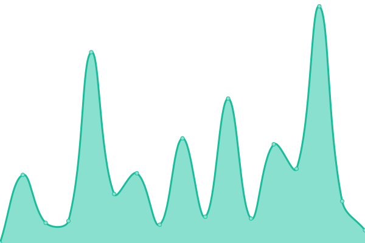 1836ms
     
 | 

<a href="https://lacabra23.github.io/upptime/history/direccion-general-de-pasaportes">99.03%</a>
    

|  [Dirección General de Migración de la República Dominicana](https://migracion.gob.do) | 🟩 Up | [direccion-general-de-migracion-de-la-republica-dominicana.yml](https://github.com/lacabra23/upptime/commits/HEAD/history/direccion-general-de-migracion-de-la-republica-dominicana.yml) | 

 0ms
     
 | 

<a href="https://lacabra23.github.io/upptime/history/direccion-general-de-migracion-de-la-republica-dominicana">100.00%</a>
    

|  [Ministerio de industria comercio y Mipymes](https://micm.gob.do) | 🟩 Up | [ministerio-de-industria-comercio-y-mipymes.yml](https://github.com/lacabra23/upptime/commits/HEAD/history/ministerio-de-industria-comercio-y-mipymes.yml) | 

 0ms
     
 | 

<a href="https://lacabra23.github.io/upptime/history/ministerio-de-industria-comercio-y-mipymes">100.00%</a>
    

|  [Ministerio de Salud Publica](https://msp.gob.do) | 🟩 Up | [ministerio-de-salud-publica.yml](https://github.com/lacabra23/upptime/commits/HEAD/history/ministerio-de-salud-publica.yml) | 

 0ms
     
 | 

<a href="https://lacabra23.github.io/upptime/history/ministerio-de-salud-publica">100.00%</a>
    

|  [Cámara de Cuentas de la República Dominicana](https://camaradecuentas.gob.do) | 🟩 Up | [camara-de-cuentas-de-la-republica-dominicana.yml](https://github.com/lacabra23/upptime/commits/HEAD/history/camara-de-cuentas-de-la-republica-dominicana.yml) | 

 0ms
     
 | 

<a href="https://lacabra23.github.io/upptime/history/camara-de-cuentas-de-la-republica-dominicana">100.00%</a>
    

|  [Senado de la República Dominicana](senadord.gob.do) | 🟥 Down | [senado-de-la-republica-dominicana.yml](https://github.com/lacabra23/upptime/commits/HEAD/history/senado-de-la-republica-dominicana.yml) | 

 835ms
     
 | 

<a href="https://lacabra23.github.io/upptime/history/senado-de-la-republica-dominicana">87.42%</a>
    

|  [Cámara de Diputados de la República Dominicana](https://camaradediputados.gob.do) | 🟩 Up | [camara-de-diputados-de-la-republica-dominicana.yml](https://github.com/lacabra23/upptime/commits/HEAD/history/camara-de-diputados-de-la-republica-dominicana.yml) | 

 0ms
     
 | 

<a href="https://lacabra23.github.io/upptime/history/camara-de-diputados-de-la-republica-dominicana">100.00%</a>
    

|  [Junta Central Electoral](https://jce.gob.do) | 🟩 Up | [junta-central-electoral.yml](https://github.com/lacabra23/upptime/commits/HEAD/history/junta-central-electoral.yml) | 

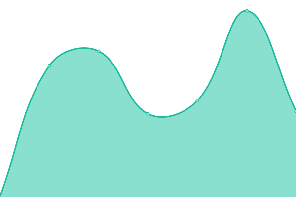 374ms
     
 | 

<a href="https://lacabra23.github.io/upptime/history/junta-central-electoral">67.58%</a>
    

|  [Poder Judicial de la República Dominicana](https://poderjudicial.gob.do) | 🟩 Up | [poder-judicial-de-la-republica-dominicana.yml](https://github.com/lacabra23/upptime/commits/HEAD/history/poder-judicial-de-la-republica-dominicana.yml) | 

 1602ms
     
 | 

<a href="https://lacabra23.github.io/upptime/history/poder-judicial-de-la-republica-dominicana">98.32%</a>
    

|  [Ministerio de Deportes y Recreación](https://miderec.gob.do) | 🟩 Up | [ministerio-de-deportes-y-recreacion.yml](https://github.com/lacabra23/upptime/commits/HEAD/history/ministerio-de-deportes-y-recreacion.yml) | 

 0ms
     
 | 

<a href="https://lacabra23.github.io/upptime/history/ministerio-de-deportes-y-recreacion">100.00%</a>
    

|  [Ministerio de Energía y Minas](https://mem.gob.do) | 🟩 Up | [ministerio-de-energia-y-minas.yml](https://github.com/lacabra23/upptime/commits/HEAD/history/ministerio-de-energia-y-minas.yml) | 

 0ms
     
 | 

<a href="https://lacabra23.github.io/upptime/history/ministerio-de-energia-y-minas">100.00%</a>
    

|  [Ministerio de Cultura](https://cultura.gob.do) | 🟩 Up | [ministerio-de-cultura.yml](https://github.com/lacabra23/upptime/commits/HEAD/history/ministerio-de-cultura.yml) | 

 831ms
     
 | 

<a href="https://lacabra23.github.io/upptime/history/ministerio-de-cultura">91.02%</a>
    

|  [Ministerio de Relaciones Exteriores](https://mirex.gob.do) | 🟩 Up | [ministerio-de-relaciones-exteriores.yml](https://github.com/lacabra23/upptime/commits/HEAD/history/ministerio-de-relaciones-exteriores.yml) | 

 1729ms
     
 | 

<a href="https://lacabra23.github.io/upptime/history/ministerio-de-relaciones-exteriores">92.62%</a>
    

|  [Ministerio de Turismo](https://mitur.gob.do) | 🟩 Up | [ministerio-de-turismo.yml](https://github.com/lacabra23/upptime/commits/HEAD/history/ministerio-de-turismo.yml) | 

 172ms
     
 | 

<a href="https://lacabra23.github.io/upptime/history/ministerio-de-turismo">78.07%</a>
    

|  [Ministerio de Trabajo](https://mt.gob.do) | 🟩 Up | [ministerio-de-trabajo.yml](https://github.com/lacabra23/upptime/commits/HEAD/history/ministerio-de-trabajo.yml) | 

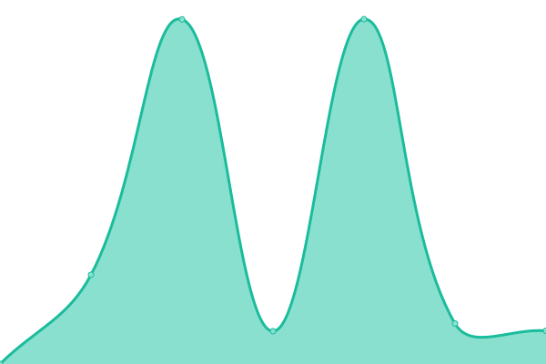 8345ms
     
 | 

<a href="https://lacabra23.github.io/upptime/history/ministerio-de-trabajo">98.66%</a>
    

|  [Ministerio de la Mujer](https://mujer.gob.do) | 🟩 Up | [ministerio-de-la-mujer.yml](https://github.com/lacabra23/upptime/commits/HEAD/history/ministerio-de-la-mujer.yml) | 

 0ms
     
 | 

<a href="https://lacabra23.github.io/upptime/history/ministerio-de-la-mujer">100.00%</a>
    

|  [Ministerio de la Vivienda Hábitat y Edificaciones](https://mived.gob.do) | 🟩 Up | [ministerio-de-la-vivienda-habitat-y-edificaciones.yml](https://github.com/lacabra23/upptime/commits/HEAD/history/ministerio-de-la-vivienda-habitat-y-edificaciones.yml) | 

 0ms
     
 | 

<a href="https://lacabra23.github.io/upptime/history/ministerio-de-la-vivienda-habitat-y-edificaciones">100.00%</a>
    

|  [Ministerio de Economía Planificación y Desarrollo](https://mepyd.gob.do) | 🟩 Up | [ministerio-de-economia-planificacion-y-desarrollo.yml](https://github.com/lacabra23/upptime/commits/HEAD/history/ministerio-de-economia-planificacion-y-desarrollo.yml) | 

 0ms
     
 | 

<a href="https://lacabra23.github.io/upptime/history/ministerio-de-economia-planificacion-y-desarrollo">100.00%</a>
    

|  [Ministerio de Medio Ambiente y Recursos Naturales](https://ambiente.gob.do) | 🟩 Up | [ministerio-de-medio-ambiente-y-recursos-naturales.yml](https://github.com/lacabra23/upptime/commits/HEAD/history/ministerio-de-medio-ambiente-y-recursos-naturales.yml) | 

 0ms
     
 | 

<a href="https://lacabra23.github.io/upptime/history/ministerio-de-medio-ambiente-y-recursos-naturales">100.00%</a>
    

|  [Ministerio de Agricultura](https://agricultura.gob.do) | 🟥 Down | [ministerio-de-agricultura.yml](https://github.com/lacabra23/upptime/commits/HEAD/history/ministerio-de-agricultura.yml) | 

 0ms
     
 | 

<a href="https://lacabra23.github.io/upptime/history/ministerio-de-agricultura">0.00%</a>
    

|  [Ministerio de la Juventud](https://juventud.gob.do) | 🟩 Up | [ministerio-de-la-juventud.yml](https://github.com/lacabra23/upptime/commits/HEAD/history/ministerio-de-la-juventud.yml) | 

 0ms
     
 | 

<a href="https://lacabra23.github.io/upptime/history/ministerio-de-la-juventud">100.00%</a>
    

|  [Ministerio Administrativo de la Presidencia](https://mapre.gob.do) | 🟩 Up | [ministerio-administrativo-de-la-presidencia.yml](https://github.com/lacabra23/upptime/commits/HEAD/history/ministerio-administrativo-de-la-presidencia.yml) | 

 10109ms
     
 | 

<a href="https://lacabra23.github.io/upptime/history/ministerio-administrativo-de-la-presidencia">92.45%</a>
    

|  [Ministerio de Interior y Policía (Plataforma en línea)](https://mipenlinea.gob.do) | 🟥 Down | [ministerio-de-interior-y-policia-plataforma-en-linea.yml](https://github.com/lacabra23/upptime/commits/HEAD/history/ministerio-de-interior-y-policia-plataforma-en-linea.yml) | 

 0ms
     
 | 

<a href="https://lacabra23.github.io/upptime/history/ministerio-de-interior-y-policia-plataforma-en-linea">100.00%</a>
    

|  [Presidencia de la República Dominicana](https://presidencia.gob.do) | 🟩 Up | [presidencia-de-la-republica-dominicana.yml](https://github.com/lacabra23/upptime/commits/HEAD/history/presidencia-de-la-republica-dominicana.yml) | 

 0ms
     
 | 

<a href="https://lacabra23.github.io/upptime/history/presidencia-de-la-republica-dominicana">100.00%</a>
    

|  [Vicepresidencia de la República Dominicana](https://vicepresidencia.gob.do) | 🟩 Up | [vicepresidencia-de-la-republica-dominicana.yml](https://github.com/lacabra23/upptime/commits/HEAD/history/vicepresidencia-de-la-republica-dominicana.yml) | 

 0ms
     
 | 

<a href="https://lacabra23.github.io/upptime/history/vicepresidencia-de-la-republica-dominicana">0.00%</a>
    

|  [Ministerio de la Presidencia](https://minpre.gob.do) | 🟥 Down | [ministerio-de-la-presidencia.yml](https://github.com/lacabra23/upptime/commits/HEAD/history/ministerio-de-la-presidencia.yml) | 

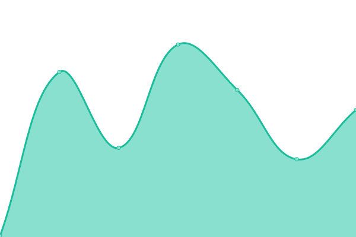 0ms
     
 | 

<a href="https://lacabra23.github.io/upptime/history/ministerio-de-la-presidencia">0.00%</a>
    

|  [Ministerio de Interior y Policía](https://mip.gob.do) | 🟩 Up | [ministerio-de-interior-y-policia.yml](https://github.com/lacabra23/upptime/commits/HEAD/history/ministerio-de-interior-y-policia.yml) | 

 3205ms
     
 | 

<a href="https://lacabra23.github.io/upptime/history/ministerio-de-interior-y-policia">93.19%</a>
    

|  [Sistema de Monitoreo de la Administración Pública](https://sismap.gob.do) | 🟩 Up | [sistema-de-monitoreo-de-la-administracion-publica.yml](https://github.com/lacabra23/upptime/commits/HEAD/history/sistema-de-monitoreo-de-la-administracion-publica.yml) | 

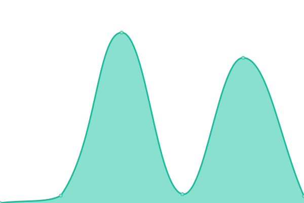 0ms
     
 | 

<a href="https://lacabra23.github.io/upptime/history/sistema-de-monitoreo-de-la-administracion-publica">100.00%</a>
    

|  [Dirección de Estrategia y Comunicación Gubernamental](https://diecom.gob.do) | 🟩 Up | [direccion-de-estrategia-y-comunicacion-gubernamental.yml](https://github.com/lacabra23/upptime/commits/HEAD/history/direccion-de-estrategia-y-comunicacion-gubernamental.yml) | 

 0ms
     
 | 

<a href="https://lacabra23.github.io/upptime/history/direccion-de-estrategia-y-comunicacion-gubernamental">100.00%</a>
    

|  [Instituto Nacional de Protección de los Derechos del Consumidor (Pro Consumidor)](https://proconsumidor.gob.do) | 🟩 Up | [instituto-nacional-de-proteccion-de-los-derechos-del-consumidor-pro-consumidor.yml](https://github.com/lacabra23/upptime/commits/HEAD/history/instituto-nacional-de-proteccion-de-los-derechos-del-consumidor-pro-consumidor.yml) | 

 0ms
     
 | 

<a href="https://lacabra23.github.io/upptime/history/instituto-nacional-de-proteccion-de-los-derechos-del-consumidor-pro-consumidor">100.00%</a>
    

|  [Dirección General de Aduanas](https://aduanas.gob.do) | 🟩 Up | [direccion-general-de-aduanas.yml](https://github.com/lacabra23/upptime/commits/HEAD/history/direccion-general-de-aduanas.yml) | 

 0ms
     
 | 

<a href="https://lacabra23.github.io/upptime/history/direccion-general-de-aduanas">100.00%</a>
    

|  [Tribunal Constitucional de la República Dominicana](https://tribunalconstitucional.gob.do) | 🟩 Up | [tribunal-constitucional-de-la-republica-dominicana.yml](https://github.com/lacabra23/upptime/commits/HEAD/history/tribunal-constitucional-de-la-republica-dominicana.yml) | 

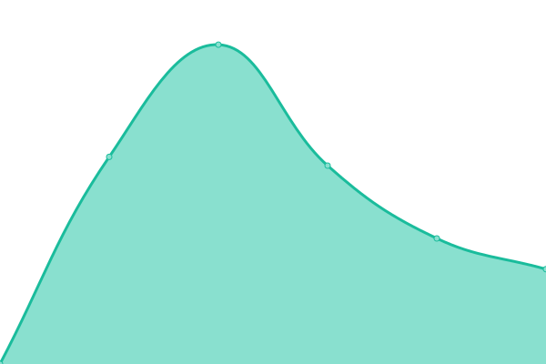 3873ms
     
 | 

<a href="https://lacabra23.github.io/upptime/history/tribunal-constitucional-de-la-republica-dominicana">78.98%</a>
    

|  [Sistema Único de Información y Registro](https://suir.gob.do) | 🟩 Up | [sistema-unico-de-informacion-y-registro.yml](https://github.com/lacabra23/upptime/commits/HEAD/history/sistema-unico-de-informacion-y-registro.yml) | 

 0ms
     
 | 

<a href="https://lacabra23.github.io/upptime/history/sistema-unico-de-informacion-y-registro">100.00%</a>
    

|  [Portal de Servicios del Gobierno de la República Dominicana](https://serviciosrd.gob.do) | 🟩 Up | [portal-de-servicios-del-gobierno-de-la-republica-dominicana.yml](https://github.com/lacabra23/upptime/commits/HEAD/history/portal-de-servicios-del-gobierno-de-la-republica-dominicana.yml) | 

 0ms
     
 | 

<a href="https://lacabra23.github.io/upptime/history/portal-de-servicios-del-gobierno-de-la-republica-dominicana">100.00%</a>
    

|  [Plataforma Soy Yo RD (Identidad Digital del Gobierno Dominicano)](https://soyyord.gob.do) | 🟩 Up | [plataforma-soy-yo-rd-identidad-digital-del-gobierno-dominicano.yml](https://github.com/lacabra23/upptime/commits/HEAD/history/plataforma-soy-yo-rd-identidad-digital-del-gobierno-dominicano.yml) | 

 0ms
     
 | 

<a href="https://lacabra23.github.io/upptime/history/plataforma-soy-yo-rd-identidad-digital-del-gobierno-dominicano">100.00%</a>
    

|  [Dirección General de Presupuesto](https://digepres.gob.do) | 🟥 Down | [direccion-general-de-presupuesto.yml](https://github.com/lacabra23/upptime/commits/HEAD/history/direccion-general-de-presupuesto.yml) | 

 0ms
     
 | 

<a href="https://lacabra23.github.io/upptime/history/direccion-general-de-presupuesto">0.00%</a>
    

|  [Dirección General de Ética e Integridad Gubernamental](https://digeig.gob.do) | 🟩 Up | [direccion-general-de-etica-e-integridad-gubernamental.yml](https://github.com/lacabra23/upptime/commits/HEAD/history/direccion-general-de-etica-e-integridad-gubernamental.yml) | 

 0ms
     
 | 

<a href="https://lacabra23.github.io/upptime/history/direccion-general-de-etica-e-integridad-gubernamental">100.00%</a>
    

|  [Dirección General de Contrataciones Públicas](https://dgcp.gob.do) | 🟩 Up | [direccion-general-de-contrataciones-publicas.yml](https://github.com/lacabra23/upptime/commits/HEAD/history/direccion-general-de-contrataciones-publicas.yml) | 

 0ms
     
 | 

<a href="https://lacabra23.github.io/upptime/history/direccion-general-de-contrataciones-publicas">100.00%</a>
    

|  [Instituto Dominicano de las Telecomunicaciones (INDOTEL)](https://indotel.gob.do) | 🟩 Up | [instituto-dominicano-de-las-telecomunicaciones-indotel.yml](https://github.com/lacabra23/upptime/commits/HEAD/history/instituto-dominicano-de-las-telecomunicaciones-indotel.yml) | 

 0ms
     
 | 

<a href="https://lacabra23.github.io/upptime/history/instituto-dominicano-de-las-telecomunicaciones-indotel">100.00%</a>
    

|  [Oficina Gubernamental de Tecnologías de la Información y Comunicación (OGTIC)](https://ogtic.gob.do) | 🟩 Up | [oficina-gubernamental-de-tecnologias-de-la-informacion-y-comunicacion-ogtic.yml](https://github.com/lacabra23/upptime/commits/HEAD/history/oficina-gubernamental-de-tecnologias-de-la-informacion-y-comunicacion-ogtic.yml) | 

 0ms
     
 | 

<a href="https://lacabra23.github.io/upptime/history/oficina-gubernamental-de-tecnologias-de-la-informacion-y-comunicacion-ogtic">100.00%</a>
    

|  [Administradora de Riesgos de Salud del Seguro Nacional de Salud (ARS SENASA)](https://arssenasa.gob.do) | 🟩 Up | [administradora-de-riesgos-de-salud-del-seguro-nacional-de-salud-ars-senasa.yml](https://github.com/lacabra23/upptime/commits/HEAD/history/administradora-de-riesgos-de-salud-del-seguro-nacional-de-salud-ars-senasa.yml) | 

 1320ms
     
 | 

<a href="https://lacabra23.github.io/upptime/history/administradora-de-riesgos-de-salud-del-seguro-nacional-de-salud-ars-senasa">100.00%</a>
    

|  [Servicio Nacional de Salud (SNS)](https://sns.gob.do) | 🟩 Up | [servicio-nacional-de-salud-sns.yml](https://github.com/lacabra23/upptime/commits/HEAD/history/servicio-nacional-de-salud-sns.yml) | 

 5039ms
     
 | 

<a href="https://lacabra23.github.io/upptime/history/servicio-nacional-de-salud-sns">99.46%</a>
    

|  [Hospital Dr. Darío Contreras](https://dariocontreras.gob.do) | 🟩 Up | [hospital-dr-dario-contreras.yml](https://github.com/lacabra23/upptime/commits/HEAD/history/hospital-dr-dario-contreras.yml) | 

 2301ms
     
 | 

<a href="https://lacabra23.github.io/upptime/history/hospital-dr-dario-contreras">99.49%</a>
    

|  [Hospital General de la Policía Nacional](https://hosgedopol.gob.do) | 🟩 Up | [hospital-general-de-la-policia-nacional.yml](https://github.com/lacabra23/upptime/commits/HEAD/history/hospital-general-de-la-policia-nacional.yml) | 

 0ms
     
 | 

<a href="https://lacabra23.github.io/upptime/history/hospital-general-de-la-policia-nacional">100.00%</a>
    

|  [Superintendencia de Salud y Riesgos Laborales (SISALRIL)](https://sisalril.gob.do) | 🟩 Up | [superintendencia-de-salud-y-riesgos-laborales-sisalril.yml](https://github.com/lacabra23/upptime/commits/HEAD/history/superintendencia-de-salud-y-riesgos-laborales-sisalril.yml) | 

 2164ms
     
 | 

<a href="https://lacabra23.github.io/upptime/history/superintendencia-de-salud-y-riesgos-laborales-sisalril">100.00%</a>
    

|  [Central Termoeléctrica Punta Catalina](https://puntacatalina.gob.do) | 🟥 Down | [central-termoelectrica-punta-catalina.yml](https://github.com/lacabra23/upptime/commits/HEAD/history/central-termoelectrica-punta-catalina.yml) | 

 0ms
     
 | 

<a href="https://lacabra23.github.io/upptime/history/central-termoelectrica-punta-catalina">0.00%</a>
    

|  [Consejo Nacional de Energía (CNE)](https://cne.gob.do) | 🟩 Up | [consejo-nacional-de-energia-cne.yml](https://github.com/lacabra23/upptime/commits/HEAD/history/consejo-nacional-de-energia-cne.yml) | 

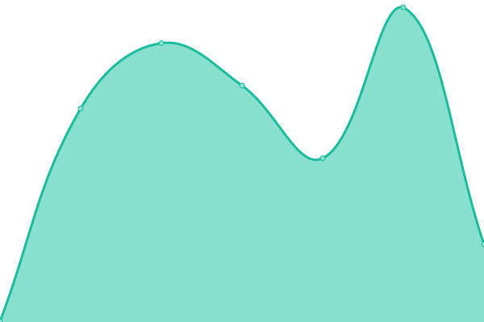 0ms
     
 | 

<a href="https://lacabra23.github.io/upptime/history/consejo-nacional-de-energia-cne">100.00%</a>
    

|  [Superintendencia de Electricidad (SIE)](https://sie.gob.do) | 🟩 Up | [superintendencia-de-electricidad-sie.yml](https://github.com/lacabra23/upptime/commits/HEAD/history/superintendencia-de-electricidad-sie.yml) | 

 0ms
     
 | 

<a href="https://lacabra23.github.io/upptime/history/superintendencia-de-electricidad-sie">100.00%</a>
    

|  [Departamento Nacional de Investigaciones (DNI)](https://dni.gov.do) | 🟥 Down | [departamento-nacional-de-investigaciones-dni.yml](https://github.com/lacabra23/upptime/commits/HEAD/history/departamento-nacional-de-investigaciones-dni.yml) | 

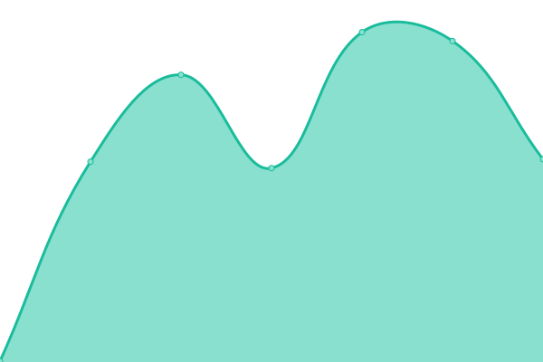 0ms
     
 | 

<a href="https://lacabra23.github.io/upptime/history/departamento-nacional-de-investigaciones-dni">0.00%</a>
    

|  [Departamento Nacional de Investigaciones (DNI)](https://dni.gob.do) | 🟥 Down | [departamento-nacional-de-investigaciones-dni.yml](https://github.com/lacabra23/upptime/commits/HEAD/history/departamento-nacional-de-investigaciones-dni.yml) | 

 0ms
     
 | 

<a href="https://lacabra23.github.io/upptime/history/departamento-nacional-de-investigaciones-dni">0.00%</a>
    

|  [Centro de Comando Control Comunicaciones Computadoras Ciberseguridad e Inteligencia de las Fuerzas Armadas (C5I FFAA)](https://c5iffaa.gob.do) | 🟥 Down | [centro-de-comando-control-comunicaciones-computadoras-ciberseguridad-e-inteligencia-de-las-fuerzas-armadas-c5-i-ffaa.yml](https://github.com/lacabra23/upptime/commits/HEAD/history/centro-de-comando-control-comunicaciones-computadoras-ciberseguridad-e-inteligencia-de-las-fuerzas-armadas-c5-i-ffaa.yml) | 

 189ms
     
 | 

<a href="https://lacabra23.github.io/upptime/history/centro-de-comando-control-comunicaciones-computadoras-ciberseguridad-e-inteligencia-de-las-fuerzas-armadas-c5-i-ffaa">100.00%</a>
    

|  [Ministerio de Defensa (MIDE)](https://mide.gob.do) | 🟥 Down | [ministerio-de-defensa-mide.yml](https://github.com/lacabra23/upptime/commits/HEAD/history/ministerio-de-defensa-mide.yml) | 

 0ms
     
 | 

<a href="https://lacabra23.github.io/upptime/history/ministerio-de-defensa-mide">0.00%</a>
    

|  [Policía Nacional](https://policianacional.gob.do) | 🟥 Down | [policia-nacional.yml](https://github.com/lacabra23/upptime/commits/HEAD/history/policia-nacional.yml) | 

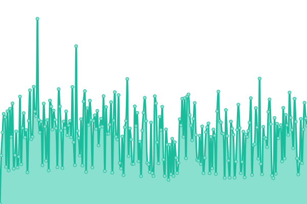 1040ms
     
 | 

<a href="https://lacabra23.github.io/upptime/history/policia-nacional">49.71%</a>
    

|  [Policía Nacional](https://pn.gob.do) | 🟥 Down | [policia-nacional.yml](https://github.com/lacabra23/upptime/commits/HEAD/history/policia-nacional.yml) | 

 1040ms
     
 | 

<a href="https://lacabra23.github.io/upptime/history/policia-nacional">49.71%</a>
    

|  [Dirección de Inteligencia Militar J-2](https://j2.mil.do) | 🟩 Up | [direccion-de-inteligencia-militar-j-2.yml](https://github.com/lacabra23/upptime/commits/HEAD/history/direccion-de-inteligencia-militar-j-2.yml) | 

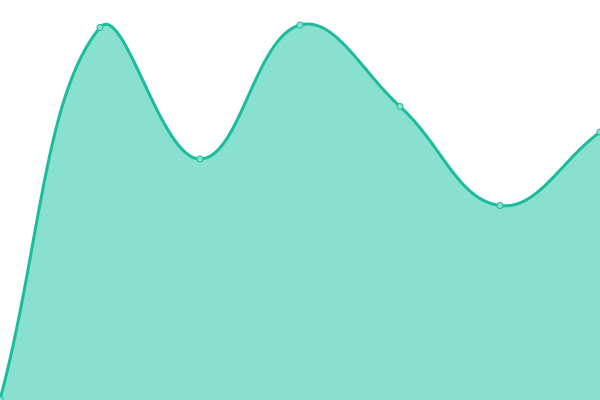 0ms
     
 | 

<a href="https://lacabra23.github.io/upptime/history/direccion-de-inteligencia-militar-j-2">100.00%</a>
    

|  [Sistema Nacional de Atención a Emergencias y Seguridad 9-1-1](https://911.gob.do) | 🟩 Up | [sistema-nacional-de-atencion-a-emergencias-y-seguridad-9-1-1.yml](https://github.com/lacabra23/upptime/commits/HEAD/history/sistema-nacional-de-atencion-a-emergencias-y-seguridad-9-1-1.yml) | 

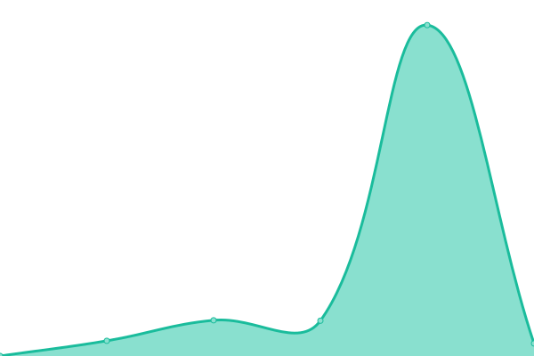 421ms
     
 | 

<a href="https://lacabra23.github.io/upptime/history/sistema-nacional-de-atencion-a-emergencias-y-seguridad-9-1-1">100.00%</a>
    

|  [Procuraduría General de la República](https://pgr.gob.do) | 🟩 Up | [procuraduria-general-de-la-republica.yml](https://github.com/lacabra23/upptime/commits/HEAD/history/procuraduria-general-de-la-republica.yml) | 

 1125ms
     
 | 

<a href="https://lacabra23.github.io/upptime/history/procuraduria-general-de-la-republica">92.10%</a>
    

|  [Dirección Nacional de Control de Drogas (DNCD)](https://dncd.gob.do) | 🟩 Up | [direccion-nacional-de-control-de-drogas-dncd.yml](https://github.com/lacabra23/upptime/commits/HEAD/history/direccion-nacional-de-control-de-drogas-dncd.yml) | 

 0ms
     
 | 

<a href="https://lacabra23.github.io/upptime/history/direccion-nacional-de-control-de-drogas-dncd">100.00%</a>
    

|  [Armada de la República Dominicana](https://armada.mil.do) | 🟩 Up | [armada-de-la-republica-dominicana.yml](https://github.com/lacabra23/upptime/commits/HEAD/history/armada-de-la-republica-dominicana.yml) | 

 0ms
     
 | 

<a href="https://lacabra23.github.io/upptime/history/armada-de-la-republica-dominicana">100.00%</a>
    

|  [Fuerza Aérea de la República Dominicana (FARD)](https://fard.mil.do) | 🟩 Up | [fuerza-aerea-de-la-republica-dominicana-fard.yml](https://github.com/lacabra23/upptime/commits/HEAD/history/fuerza-aerea-de-la-republica-dominicana-fard.yml) | 

 0ms
     
 | 

<a href="https://lacabra23.github.io/upptime/history/fuerza-aerea-de-la-republica-dominicana-fard">100.00%</a>
    

|  [Ejército de la República Dominicana](https://ejercito.mil.do) | 🟩 Up | [ejercito-de-la-republica-dominicana.yml](https://github.com/lacabra23/upptime/commits/HEAD/history/ejercito-de-la-republica-dominicana.yml) | 

 0ms
     
 | 

<a href="https://lacabra23.github.io/upptime/history/ejercito-de-la-republica-dominicana">100.00%</a>
    

|  [Cuerpo Especializado en Seguridad Fronteriza Terrestre (CESFRONT)](https://cesfront.mil.do) | 🟩 Up | [cuerpo-especializado-en-seguridad-fronteriza-terrestre-cesfront.yml](https://github.com/lacabra23/upptime/commits/HEAD/history/cuerpo-especializado-en-seguridad-fronteriza-terrestre-cesfront.yml) | 

 8212ms
     
 | 

<a href="https://lacabra23.github.io/upptime/history/cuerpo-especializado-en-seguridad-fronteriza-terrestre-cesfront">100.00%</a>
    

|  [Sistema de Emergencias de las Fuerzas Armadas (SIERD)](https://sierd.mil.do) | 🟩 Up | [sistema-de-emergencias-de-las-fuerzas-armadas-sierd.yml](https://github.com/lacabra23/upptime/commits/HEAD/history/sistema-de-emergencias-de-las-fuerzas-armadas-sierd.yml) | 

 712ms
     
 | 

<a href="https://lacabra23.github.io/upptime/history/sistema-de-emergencias-de-las-fuerzas-armadas-sierd">100.00%</a>
    

|  [Cuerpo Especializado en Seguridad del Metro (CESMET)](https://cesmet.mil.do) | 🟩 Up | [cuerpo-especializado-en-seguridad-del-metro-cesmet.yml](https://github.com/lacabra23/upptime/commits/HEAD/history/cuerpo-especializado-en-seguridad-del-metro-cesmet.yml) | 

 1726ms
     
 | 

<a href="https://lacabra23.github.io/upptime/history/cuerpo-especializado-en-seguridad-del-metro-cesmet">90.78%</a>
    

|  [Cuerpo Especializado en Seguridad Aeroportuaria y de la Aviación Civil (CESAC)](https://cesac.mil.do) | 🟩 Up | [cuerpo-especializado-en-seguridad-aeroportuaria-y-de-la-aviacion-civil-cesac.yml](https://github.com/lacabra23/upptime/commits/HEAD/history/cuerpo-especializado-en-seguridad-aeroportuaria-y-de-la-aviacion-civil-cesac.yml) | 

 2515ms
     
 | 

<a href="https://lacabra23.github.io/upptime/history/cuerpo-especializado-en-seguridad-aeroportuaria-y-de-la-aviacion-civil-cesac">100.00%</a>
    

|  [Centro de Operaciones de Emergencias (COE)](https://coe.gob.do) | 🟩 Up | [centro-de-operaciones-de-emergencias-coe.yml](https://github.com/lacabra23/upptime/commits/HEAD/history/centro-de-operaciones-de-emergencias-coe.yml) | 

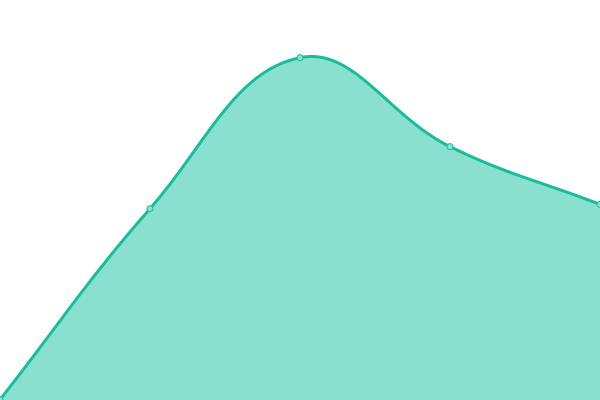 0ms
     
 | 

<a href="https://lacabra23.github.io/upptime/history/centro-de-operaciones-de-emergencias-coe">5.88%</a>
    

|  [Superintendencia de Vigilancia y Seguridad Privada (SVSP)](https://svsp.gob.do) | 🟩 Up | [superintendencia-de-vigilancia-y-seguridad-privada-svsp.yml](https://github.com/lacabra23/upptime/commits/HEAD/history/superintendencia-de-vigilancia-y-seguridad-privada-svsp.yml) | 

 484ms
     
 | 

<a href="https://lacabra23.github.io/upptime/history/superintendencia-de-vigilancia-y-seguridad-privada-svsp">100.00%</a>
    

|  [Dirección General de Seguridad de Tránsito y Transporte Terrestre (DIGESETT)](https://digesett.gob.do) | 🟥 Down | [direccion-general-de-seguridad-de-transito-y-transporte-terrestre-digesett.yml](https://github.com/lacabra23/upptime/commits/HEAD/history/direccion-general-de-seguridad-de-transito-y-transporte-terrestre-digesett.yml) | 

 0ms
     
 | 

<a href="https://lacabra23.github.io/upptime/history/direccion-general-de-seguridad-de-transito-y-transporte-terrestre-digesett">100.00%</a>
    

|  [Policía de Turismo (POLITUR)](https://politur.gob.do) | 🟩 Up | [policia-de-turismo-politur.yml](https://github.com/lacabra23/upptime/commits/HEAD/history/policia-de-turismo-politur.yml) | 

 4655ms
     
 | 

<a href="https://lacabra23.github.io/upptime/history/policia-de-turismo-politur">98.82%</a>
    

|  [Dirección General de Educación Vial](https://digev.mil.do) | 🟩 Up | [direccion-general-de-educacion-vial.yml](https://github.com/lacabra23/upptime/commits/HEAD/history/direccion-general-de-educacion-vial.yml) | 

 0ms
     
 | 

<a href="https://lacabra23.github.io/upptime/history/direccion-general-de-educacion-vial">58.26%</a>
    

|  [Cuerpo Especializado de Control de Combustibles (CECCOM)](https://ceccom.gob.do) | 🟩 Up | [cuerpo-especializado-de-control-de-combustibles-ceccom.yml](https://github.com/lacabra23/upptime/commits/HEAD/history/cuerpo-especializado-de-control-de-combustibles-ceccom.yml) | 

 0ms
     
 | 

<a href="https://lacabra23.github.io/upptime/history/cuerpo-especializado-de-control-de-combustibles-ceccom">100.00%</a>
    

|  [Cuerpo Especializado en Seguridad Portuaria (CESEP)](https://cesep.mil.do) | 🟩 Up | [cuerpo-especializado-en-seguridad-portuaria-cesep.yml](https://github.com/lacabra23/upptime/commits/HEAD/history/cuerpo-especializado-en-seguridad-portuaria-cesep.yml) | 

 205ms
     
 | 

<a href="https://lacabra23.github.io/upptime/history/cuerpo-especializado-en-seguridad-portuaria-cesep">97.19%</a>
    

|  [Instituto de Seguridad Social de las Fuerzas Armadas (ISSFFAA)](https://issffaa.mil.do) | 🟩 Up | [instituto-de-seguridad-social-de-las-fuerzas-armadas-issffaa.yml](https://github.com/lacabra23/upptime/commits/HEAD/history/instituto-de-seguridad-social-de-las-fuerzas-armadas-issffaa.yml) | 

 689ms
     
 | 

<a href="https://lacabra23.github.io/upptime/history/instituto-de-seguridad-social-de-las-fuerzas-armadas-issffaa">100.00%</a>
    

|  [Dirección General de Dragas Presas y Balizamiento](https://dragas.mil.do) | 🟩 Up | [direccion-general-de-dragas-presas-y-balizamiento.yml](https://github.com/lacabra23/upptime/commits/HEAD/history/direccion-general-de-dragas-presas-y-balizamiento.yml) | 

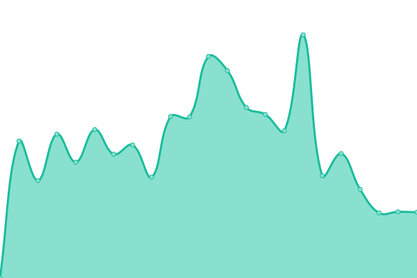 3205ms
     
 | 

<a href="https://lacabra23.github.io/upptime/history/direccion-general-de-dragas-presas-y-balizamiento">73.65%</a>
    

|  [Comisión Permanente de Efemérides Patrias](https://copremfa.mil.do) | 🟩 Up | [comision-permanente-de-efemerides-patrias.yml](https://github.com/lacabra23/upptime/commits/HEAD/history/comision-permanente-de-efemerides-patrias.yml) | 

 414ms
     
 | 

<a href="https://lacabra23.github.io/upptime/history/comision-permanente-de-efemerides-patrias">99.47%</a>
    

|  [Defensa Civil Dominicana](https://defensacivil.gob.do) | 🟩 Up | [defensa-civil-dominicana.yml](https://github.com/lacabra23/upptime/commits/HEAD/history/defensa-civil-dominicana.yml) | 

 0ms
     
 | 

<a href="https://lacabra23.github.io/upptime/history/defensa-civil-dominicana">100.00%</a>
    

|  [Dirección General de Impuestos Internos (DGII)](https://dgii.gov.do) | 🟩 Up | [direccion-general-de-impuestos-internos-dgii.yml](https://github.com/lacabra23/upptime/commits/HEAD/history/direccion-general-de-impuestos-internos-dgii.yml) | 

 0ms
     
 | 

<a href="https://lacabra23.github.io/upptime/history/direccion-general-de-impuestos-internos-dgii">100.00%</a>
    

|  [Ministerio de Hacienda](https://hacienda.gob.do) | 🟩 Up | [ministerio-de-hacienda.yml](https://github.com/lacabra23/upptime/commits/HEAD/history/ministerio-de-hacienda.yml) | 

 0ms
     
 | 

<a href="https://lacabra23.github.io/upptime/history/ministerio-de-hacienda">100.00%</a>
    

|  [Banco Central de la República Dominicana](https://bancentral.gov.do) | 🟩 Up | [banco-central-de-la-republica-dominicana.yml](https://github.com/lacabra23/upptime/commits/HEAD/history/banco-central-de-la-republica-dominicana.yml) | 

 0ms
     
 | 

<a href="https://lacabra23.github.io/upptime/history/banco-central-de-la-republica-dominicana">100.00%</a>
    

|  [ProUsuario (Superintendencia de Bancos)](https://prousuario.gob.do) | 🟩 Up | [pro-usuario-superintendencia-de-bancos.yml](https://github.com/lacabra23/upptime/commits/HEAD/history/pro-usuario-superintendencia-de-bancos.yml) | 

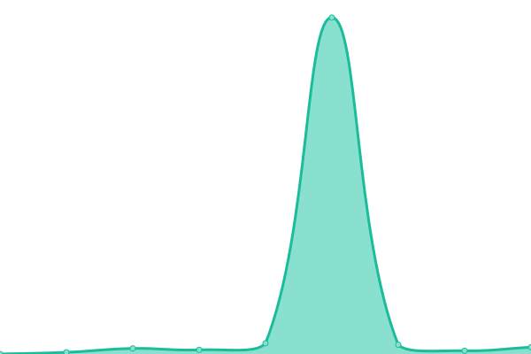 418ms
     
 | 

<a href="https://lacabra23.github.io/upptime/history/pro-usuario-superintendencia-de-bancos">93.13%</a>
    

|  [Superintendencia de Bancos](https://sb.gob.do) | 🟩 Up | [superintendencia-de-bancos.yml](https://github.com/lacabra23/upptime/commits/HEAD/history/superintendencia-de-bancos.yml) | 

 1756ms
     
 | 

<a href="https://lacabra23.github.io/upptime/history/superintendencia-de-bancos">80.10%</a>
    

|  [Banco Agrícola de la República Dominicana](https://bagricola.gob.do) | 🟩 Up | [banco-agricola-de-la-republica-dominicana.yml](https://github.com/lacabra23/upptime/commits/HEAD/history/banco-agricola-de-la-republica-dominicana.yml) | 

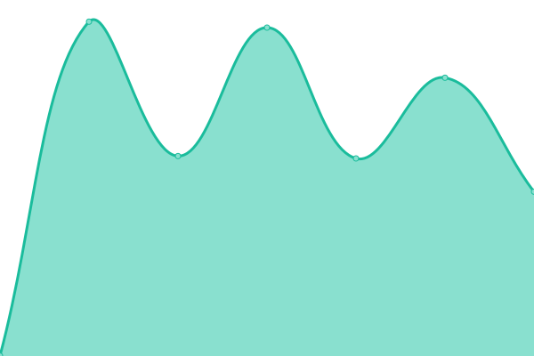 0ms
     
 | 

<a href="https://lacabra23.github.io/upptime/history/banco-agricola-de-la-republica-dominicana">100.00%</a>
    

|  [Banco Agrícola de la República Dominicana](https://bancoagricola.gob.do) | 🟩 Up | [banco-agricola-de-la-republica-dominicana.yml](https://github.com/lacabra23/upptime/commits/HEAD/history/banco-agricola-de-la-republica-dominicana.yml) | 

 0ms
     
 | 

<a href="https://lacabra23.github.io/upptime/history/banco-agricola-de-la-republica-dominicana">100.00%</a>
    

|  [Superintendencia de Pensiones (SIPEN)](https://sprics.gov.do) | 🟩 Up | [superintendencia-de-pensiones-sipen.yml](https://github.com/lacabra23/upptime/commits/HEAD/history/superintendencia-de-pensiones-sipen.yml) | 

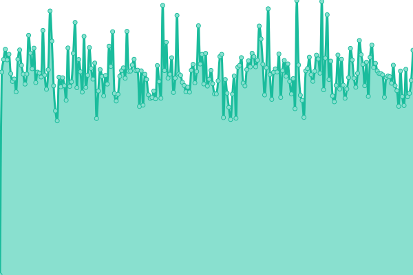 1816ms
     
 | 

<a href="https://lacabra23.github.io/upptime/history/superintendencia-de-pensiones-sipen">99.54%</a>
    

|  [Superintendencia de Pensiones (SIPEN)](https://sipen.gob.do) | 🟩 Up | [superintendencia-de-pensiones-sipen.yml](https://github.com/lacabra23/upptime/commits/HEAD/history/superintendencia-de-pensiones-sipen.yml) | 

 1816ms
     
 | 

<a href="https://lacabra23.github.io/upptime/history/superintendencia-de-pensiones-sipen">99.54%</a>
    

|  [Administradora de Subsidios Sociales (ADESS)](https://adess.gob.do) | 🟩 Up | [administradora-de-subsidios-sociales-adess.yml](https://github.com/lacabra23/upptime/commits/HEAD/history/administradora-de-subsidios-sociales-adess.yml) | 

 1142ms
     
 | 

<a href="https://lacabra23.github.io/upptime/history/administradora-de-subsidios-sociales-adess">92.98%</a>
    

|  [Superintendencia del Mercado de Valores (SIMV)](https://simv.gob.do) | 🟥 Down | [superintendencia-del-mercado-de-valores-simv.yml](https://github.com/lacabra23/upptime/commits/HEAD/history/superintendencia-del-mercado-de-valores-simv.yml) | 

 0ms
     
 | 

<a href="https://lacabra23.github.io/upptime/history/superintendencia-del-mercado-de-valores-simv">0.00%</a>
    

|  [Tesorería Nacional](https://tesoreria.gob.do) | 🟥 Down | [tesoreria-nacional.yml](https://github.com/lacabra23/upptime/commits/HEAD/history/tesoreria-nacional.yml) | 

 0ms
     
 | 

<a href="https://lacabra23.github.io/upptime/history/tesoreria-nacional">0.00%</a>
    

|  [Instituto de Desarrollo y Crédito Cooperativo (IDECOOP)](https://idecoop.gob.do) | 🟩 Up | [instituto-de-desarrollo-y-credito-cooperativo-idecoop.yml](https://github.com/lacabra23/upptime/commits/HEAD/history/instituto-de-desarrollo-y-credito-cooperativo-idecoop.yml) | 

 2315ms
     
 | 

<a href="https://lacabra23.github.io/upptime/history/instituto-de-desarrollo-y-credito-cooperativo-idecoop">100.00%</a>
    

|  [Instituto Nacional de Tránsito y Transporte Terrestre (INTRANT)](https://intrant.gob.do) | 🟩 Up | [instituto-nacional-de-transito-y-transporte-terrestre-intrant.yml](https://github.com/lacabra23/upptime/commits/HEAD/history/instituto-nacional-de-transito-y-transporte-terrestre-intrant.yml) | 

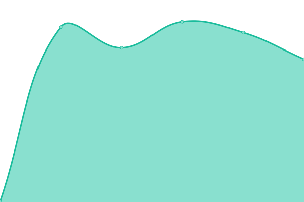 731ms
     
 | 

<a href="https://lacabra23.github.io/upptime/history/instituto-nacional-de-transito-y-transporte-terrestre-intrant">100.00%</a>
    

|  [Oficina Metropolitana de Servicios de Autobuses (OMSA)](https://omsa.gob.do) | 🟩 Up | [oficina-metropolitana-de-servicios-de-autobuses-omsa.yml](https://github.com/lacabra23/upptime/commits/HEAD/history/oficina-metropolitana-de-servicios-de-autobuses-omsa.yml) | 

 0ms
     
 | 

<a href="https://lacabra23.github.io/upptime/history/oficina-metropolitana-de-servicios-de-autobuses-omsa">100.00%</a>
    

|  [Oficina para el Reordenamiento del Transporte (OPRET)](https://opret.gob.do) | 🟥 Down | [oficina-para-el-reordenamiento-del-transporte-opret.yml](https://github.com/lacabra23/upptime/commits/HEAD/history/oficina-para-el-reordenamiento-del-transporte-opret.yml) | 

 0ms
     
 | 

<a href="https://lacabra23.github.io/upptime/history/oficina-para-el-reordenamiento-del-transporte-opret">100.00%</a>
    

|  [Autoridad Portuaria Dominicana](https://portuaria.gob.do) | 🟩 Up | [autoridad-portuaria-dominicana.yml](https://github.com/lacabra23/upptime/commits/HEAD/history/autoridad-portuaria-dominicana.yml) | 

 0ms
     
 | 

<a href="https://lacabra23.github.io/upptime/history/autoridad-portuaria-dominicana">100.00%</a>
    

|  [Ministerio de Obras Públicas y Comunicaciones (MOPC)](https://mopc.gob.do) | 🟥 Down | [ministerio-de-obras-publicas-y-comunicaciones-mopc.yml](https://github.com/lacabra23/upptime/commits/HEAD/history/ministerio-de-obras-publicas-y-comunicaciones-mopc.yml) | 

 0ms
     
 | 

<a href="https://lacabra23.github.io/upptime/history/ministerio-de-obras-publicas-y-comunicaciones-mopc">0.00%</a>
    

|  [Junta de Aviación Civil (JAC)](https://jac.gob.do) | 🟩 Up | [junta-de-aviacion-civil-jac.yml](https://github.com/lacabra23/upptime/commits/HEAD/history/junta-de-aviacion-civil-jac.yml) | 

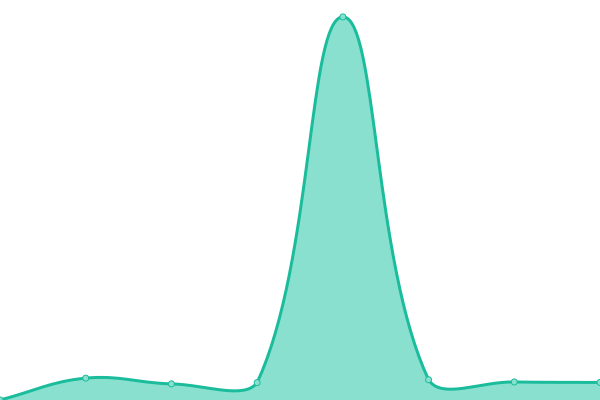 0ms
     
 | 

<a href="https://lacabra23.github.io/upptime/history/junta-de-aviacion-civil-jac">100.00%</a>
    

|  [Instituto Dominicano de Aviación Civil (IDAC)](https://idac.gob.do) | 🟩 Up | [instituto-dominicano-de-aviacion-civil-idac.yml](https://github.com/lacabra23/upptime/commits/HEAD/history/instituto-dominicano-de-aviacion-civil-idac.yml) | 

 3317ms
     
 | 

<a href="https://lacabra23.github.io/upptime/history/instituto-dominicano-de-aviacion-civil-idac">100.00%</a>
    

|  [Instituto Postal Dominicano (INPOSDOM)](https://inposdom.gob.do) | 🟩 Up | [instituto-postal-dominicano-inposdom.yml](https://github.com/lacabra23/upptime/commits/HEAD/history/instituto-postal-dominicano-inposdom.yml) | 

 0ms
     
 | 

<a href="https://lacabra23.github.io/upptime/history/instituto-postal-dominicano-inposdom">100.00%</a>
    

|  [Paso Rápido (Sistema de peajes)](pasorapido.gob.do) | 🟥 Down | [paso-rapido-sistema-de-peajes.yml](https://github.com/lacabra23/upptime/commits/HEAD/history/paso-rapido-sistema-de-peajes.yml) | 

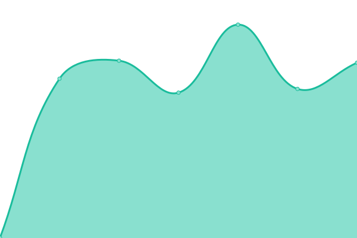 1031ms
     
 | 

<a href="https://lacabra23.github.io/upptime/history/paso-rapido-sistema-de-peajes">99.12%</a>
    

|  [Ministerio de Educación](https://ministeriodeeducacion.gob.do) | 🟩 Up | [ministerio-de-educacion.yml](https://github.com/lacabra23/upptime/commits/HEAD/history/ministerio-de-educacion.yml) | 

 4184ms
     
 | 

<a href="https://lacabra23.github.io/upptime/history/ministerio-de-educacion">72.50%</a>
    

|  [Instituto Nacional de Bienestar Estudiantil (INABIE)](https://inabie.gob.do) | 🟩 Up | [instituto-nacional-de-bienestar-estudiantil-inabie.yml](https://github.com/lacabra23/upptime/commits/HEAD/history/instituto-nacional-de-bienestar-estudiantil-inabie.yml) | 

 0ms
     
 | 

<a href="https://lacabra23.github.io/upptime/history/instituto-nacional-de-bienestar-estudiantil-inabie">0.00%</a>
    

|  [Ministerio de Educación Superior Ciencia y Tecnología (MESCyT)](https://mescyt.gob.do) | 🟩 Up | [ministerio-de-educacion-superior-ciencia-y-tecnologia-mes-cy-t.yml](https://github.com/lacabra23/upptime/commits/HEAD/history/ministerio-de-educacion-superior-ciencia-y-tecnologia-mes-cy-t.yml) | 

 0ms
     
 | 

<a href="https://lacabra23.github.io/upptime/history/ministerio-de-educacion-superior-ciencia-y-tecnologia-mes-cy-t">100.00%</a>
    

|  [Programa Nacional de Becas (BECAS)](https://becas.gob.do) | 🟩 Up | [programa-nacional-de-becas-becas.yml](https://github.com/lacabra23/upptime/commits/HEAD/history/programa-nacional-de-becas-becas.yml) | 

 0ms
     
 | 

<a href="https://lacabra23.github.io/upptime/history/programa-nacional-de-becas-becas">100.00%</a>
    

|  [Instituto Nacional de Formación Técnico Profesional (INFOTEP)](https://infotep.gob.do) | 🟥 Down | [instituto-nacional-de-formacion-tecnico-profesional-infotep.yml](https://github.com/lacabra23/upptime/commits/HEAD/history/instituto-nacional-de-formacion-tecnico-profesional-infotep.yml) | 

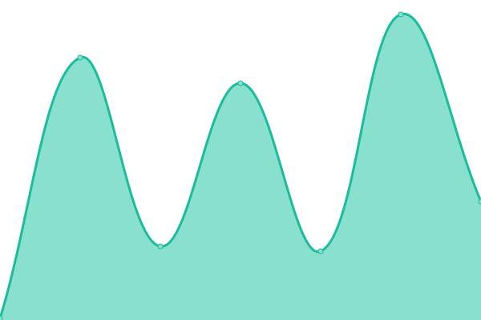 0ms
     
 | 

<a href="https://lacabra23.github.io/upptime/history/instituto-nacional-de-formacion-tecnico-profesional-infotep">100.00%</a>
    

|  [Corporación del Acueducto y Alcantarillado de Santo Domingo (CAASD)](https://caasd.gob.do) | 🟩 Up | [corporacion-del-acueducto-y-alcantarillado-de-santo-domingo-caasd.yml](https://github.com/lacabra23/upptime/commits/HEAD/history/corporacion-del-acueducto-y-alcantarillado-de-santo-domingo-caasd.yml) | 

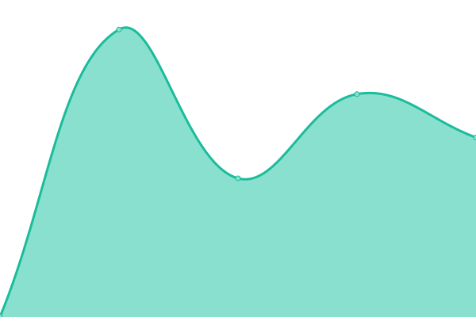 0ms
     
 | 

<a href="https://lacabra23.github.io/upptime/history/corporacion-del-acueducto-y-alcantarillado-de-santo-domingo-caasd">100.00%</a>
    

|  [Instituto Nacional de Aguas Potables y Alcantarillados (INAPA)](https://inapa.gob.do) | 🟩 Up | [instituto-nacional-de-aguas-potables-y-alcantarillados-inapa.yml](https://github.com/lacabra23/upptime/commits/HEAD/history/instituto-nacional-de-aguas-potables-y-alcantarillados-inapa.yml) | 

 0ms
     
 | 

<a href="https://lacabra23.github.io/upptime/history/instituto-nacional-de-aguas-potables-y-alcantarillados-inapa">100.00%</a>
    

|  [Corporación del Acueducto y Alcantarillado de Santiago (CORAASAN)](https://coraasan.gob.do) | 🟥 Down | [corporacion-del-acueducto-y-alcantarillado-de-santiago-coraasan.yml](https://github.com/lacabra23/upptime/commits/HEAD/history/corporacion-del-acueducto-y-alcantarillado-de-santiago-coraasan.yml) | 

 0ms
     
 | 

<a href="https://lacabra23.github.io/upptime/history/corporacion-del-acueducto-y-alcantarillado-de-santiago-coraasan">100.00%</a>
    

|  [Instituto Nacional de Recursos Hidráulicos (INDRHI)](https://indrhi.gob.do) | 🟩 Up | [instituto-nacional-de-recursos-hidraulicos-indrhi.yml](https://github.com/lacabra23/upptime/commits/HEAD/history/instituto-nacional-de-recursos-hidraulicos-indrhi.yml) | 

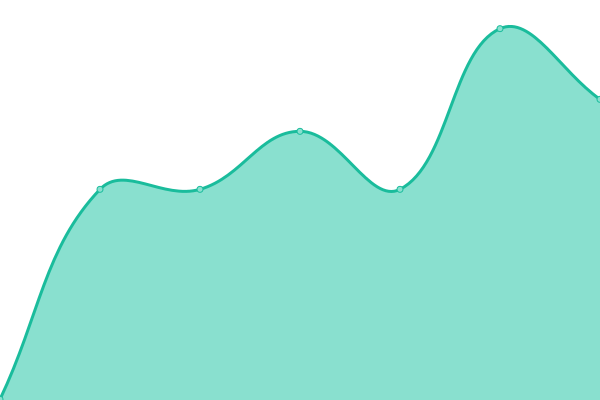 0ms
     
 | 

<a href="https://lacabra23.github.io/upptime/history/instituto-nacional-de-recursos-hidraulicos-indrhi">5.95%</a>
    

|  [Instituto de Estabilización de Precios (INESPRE)](https://inespre.gob.do) | 🟩 Up | [instituto-de-estabilizacion-de-precios-inespre.yml](https://github.com/lacabra23/upptime/commits/HEAD/history/instituto-de-estabilizacion-de-precios-inespre.yml) | 

 0ms
     
 | 

<a href="https://lacabra23.github.io/upptime/history/instituto-de-estabilizacion-de-precios-inespre">100.00%</a>
    

|  [Instituto Agrario Dominicano (IAD)](https://iad.gob.do) | 🟩 Up | [instituto-agrario-dominicano-iad.yml](https://github.com/lacabra23/upptime/commits/HEAD/history/instituto-agrario-dominicano-iad.yml) | 

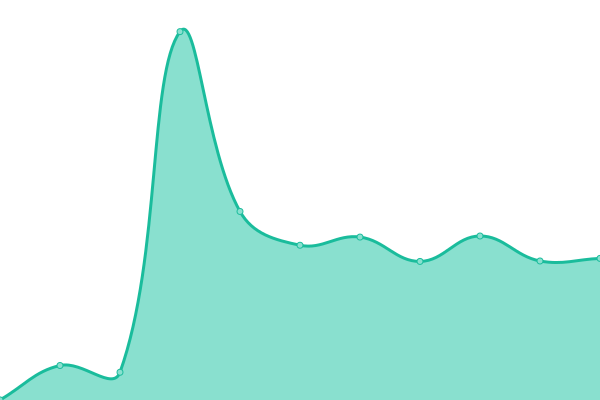 5629ms
     
 | 

<a href="https://lacabra23.github.io/upptime/history/instituto-agrario-dominicano-iad">46.09%</a>
    

|  [Acuario Nacional](https://acuarionacional.gob.do) | 🟩 Up | [acuario-nacional.yml](https://github.com/lacabra23/upptime/commits/HEAD/history/acuario-nacional.yml) | 

 0ms
     
 | 

<a href="https://lacabra23.github.io/upptime/history/acuario-nacional">5.88%</a>
    

|  [Parque Nacional Mirador del Norte](https://parquemiradornorte.gob.do) | 🟥 Down | [parque-nacional-mirador-del-norte.yml](https://github.com/lacabra23/upptime/commits/HEAD/history/parque-nacional-mirador-del-norte.yml) | 

 0ms
     
 | 

<a href="https://lacabra23.github.io/upptime/history/parque-nacional-mirador-del-norte">0.00%</a>
    

|  [Seguro Médico para Maestros (SEMMA)](https://semma.gob.do) | 🟥 Down | [seguro-medico-para-maestros-semma.yml](https://github.com/lacabra23/upptime/commits/HEAD/history/seguro-medico-para-maestros-semma.yml) | 

 0ms
     
 | 

<a href="https://lacabra23.github.io/upptime/history/seguro-medico-para-maestros-semma">0.00%</a>
    

|  [Autoridad Nacional de Asuntos Marítimos (ANAMAR)](https://anamar.gob.do) | 🟩 Up | [autoridad-nacional-de-asuntos-maritimos-anamar.yml](https://github.com/lacabra23/upptime/commits/HEAD/history/autoridad-nacional-de-asuntos-maritimos-anamar.yml) | 

 0ms
     
 | 

<a href="https://lacabra23.github.io/upptime/history/autoridad-nacional-de-asuntos-maritimos-anamar">50.49%</a>
    

|  [Autoridad Portuaria Dominicana](https://portuaria.gob.do) | 🟩 Up | [autoridad-portuaria-dominicana.yml](https://github.com/lacabra23/upptime/commits/HEAD/history/autoridad-portuaria-dominicana.yml) | 

 0ms
     
 | 

<a href="https://lacabra23.github.io/upptime/history/autoridad-portuaria-dominicana">100.00%</a>
    

|  [Biblioteca Nacional Pedro Henríquez Ureña (BNPHU)](https://bnphu.gob.do) | 🟥 Down | [biblioteca-nacional-pedro-henriquez-urena-bnphu.yml](https://github.com/lacabra23/upptime/commits/HEAD/history/biblioteca-nacional-pedro-henriquez-urena-bnphu.yml) | 

 0ms
     
 | 

<a href="https://lacabra23.github.io/upptime/history/biblioteca-nacional-pedro-henriquez-urena-bnphu">0.00%</a>
    

|  [Centro de Atención Integral para la Discapacidad (CAID)](https://caid.gob.do) | 🟩 Up | [centro-de-atencion-integral-para-la-discapacidad-caid.yml](https://github.com/lacabra23/upptime/commits/HEAD/history/centro-de-atencion-integral-para-la-discapacidad-caid.yml) | 

 0ms
     
 | 

<a href="https://lacabra23.github.io/upptime/history/centro-de-atencion-integral-para-la-discapacidad-caid">100.00%</a>
    

|  [Centro de Operaciones de Emergencias (COE)](https://coe.gob.do) | 🟩 Up | [centro-de-operaciones-de-emergencias-coe.yml](https://github.com/lacabra23/upptime/commits/HEAD/history/centro-de-operaciones-de-emergencias-coe.yml) | 

 0ms
     
 | 

<a href="https://lacabra23.github.io/upptime/history/centro-de-operaciones-de-emergencias-coe">5.88%</a>
    

|  [Comedores Económicos del Estado Dominicano](https://comedoreseconomicos.gob.do) | 🟩 Up | [comedores-economicos-del-estado-dominicano.yml](https://github.com/lacabra23/upptime/commits/HEAD/history/comedores-economicos-del-estado-dominicano.yml) | 

 0ms
     
 | 

<a href="https://lacabra23.github.io/upptime/history/comedores-economicos-del-estado-dominicano">100.00%</a>
    

|  [Instituto Nacional de Recursos Hidráulicos (INDRHI) - División de Riego](https://riego.gob.do) | 🟩 Up | [instituto-nacional-de-recursos-hidraulicos-indrhi-division-de-riego.yml](https://github.com/lacabra23/upptime/commits/HEAD/history/instituto-nacional-de-recursos-hidraulicos-indrhi-division-de-riego.yml) | 

 1657ms
     
 | 

<a href="https://lacabra23.github.io/upptime/history/instituto-nacional-de-recursos-hidraulicos-indrhi-division-de-riego">100.00%</a>
    

|  [Comisión Nacional de Defensa de la Competencia (ProCompetencia)](https://procompetencia.gob.do) | 🟩 Up | [comision-nacional-de-defensa-de-la-competencia-pro-competencia.yml](https://github.com/lacabra23/upptime/commits/HEAD/history/comision-nacional-de-defensa-de-la-competencia-pro-competencia.yml) | 

 0ms
     
 | 

<a href="https://lacabra23.github.io/upptime/history/comision-nacional-de-defensa-de-la-competencia-pro-competencia">100.00%</a>
    

|  [Comisión Presidencial de Apoyo al Desarrollo Barrial](https://desarrollobarrial.gob.do) | 🟩 Up | [comision-presidencial-de-apoyo-al-desarrollo-barrial.yml](https://github.com/lacabra23/upptime/commits/HEAD/history/comision-presidencial-de-apoyo-al-desarrollo-barrial.yml) | 

 0ms
     
 | 

<a href="https://lacabra23.github.io/upptime/history/comision-presidencial-de-apoyo-al-desarrollo-barrial">100.00%</a>
    

|  [Comisión Presidencial de Apoyo al Desarrollo Provincial (CPADP)](https://cpadp.gob.do) | 🟩 Up | [comision-presidencial-de-apoyo-al-desarrollo-provincial-cpadp.yml](https://github.com/lacabra23/upptime/commits/HEAD/history/comision-presidencial-de-apoyo-al-desarrollo-provincial-cpadp.yml) | 

 958ms
     
 | 

<a href="https://lacabra23.github.io/upptime/history/comision-presidencial-de-apoyo-al-desarrollo-provincial-cpadp">100.00%</a>
    

|  [Centro de Capacitación en Política y Gestión Fiscal (CDC)](https://cdc.gob.do) | 🟩 Up | [centro-de-capacitacion-en-politica-y-gestion-fiscal-cdc.yml](https://github.com/lacabra23/upptime/commits/HEAD/history/centro-de-capacitacion-en-politica-y-gestion-fiscal-cdc.yml) | 

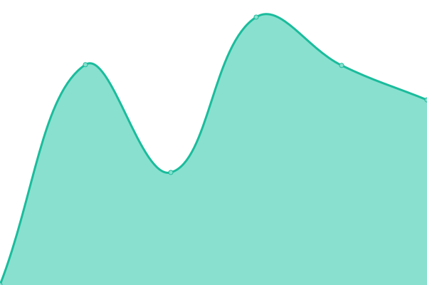 0ms
     
 | 

<a href="https://lacabra23.github.io/upptime/history/centro-de-capacitacion-en-politica-y-gestion-fiscal-cdc">100.00%</a>
    

|  [Consejo Nacional para la Niñez y la Adolescencia (CCDF)](https://ccdf.gob.do) | 🟩 Up | [consejo-nacional-para-la-ninez-y-la-adolescencia-ccdf.yml](https://github.com/lacabra23/upptime/commits/HEAD/history/consejo-nacional-para-la-ninez-y-la-adolescencia-ccdf.yml) | 

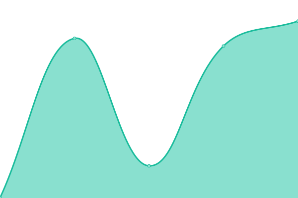 0ms
     
 | 

<a href="https://lacabra23.github.io/upptime/history/consejo-nacional-para-la-ninez-y-la-adolescencia-ccdf">100.00%</a>
    

|  [Consejo Dominicano de Pesca y Acuicultura (CODOPESCA)](https://codopesca.gob.do) | 🟩 Up | [consejo-dominicano-de-pesca-y-acuicultura-codopesca.yml](https://github.com/lacabra23/upptime/commits/HEAD/history/consejo-dominicano-de-pesca-y-acuicultura-codopesca.yml) | 

 3548ms
     
 | 

<a href="https://lacabra23.github.io/upptime/history/consejo-dominicano-de-pesca-y-acuicultura-codopesca">100.00%</a>
    

|  [Corporación de Acueducto y Alcantarillado de Boca Chica (CORAABO)](https://coraabo.gob.do) | 🟩 Up | [corporacion-de-acueducto-y-alcantarillado-de-boca-chica-coraabo.yml](https://github.com/lacabra23/upptime/commits/HEAD/history/corporacion-de-acueducto-y-alcantarillado-de-boca-chica-coraabo.yml) | 

 1376ms
     
 | 

<a href="https://lacabra23.github.io/upptime/history/corporacion-de-acueducto-y-alcantarillado-de-boca-chica-coraabo">100.00%</a>
    

|  [Corporación de Acueducto y Alcantarillado de La Romana (COAAROM)](https://coaarom.gob.do) | 🟩 Up | [corporacion-de-acueducto-y-alcantarillado-de-la-romana-coaarom.yml](https://github.com/lacabra23/upptime/commits/HEAD/history/corporacion-de-acueducto-y-alcantarillado-de-la-romana-coaarom.yml) | 

 4306ms
     
 | 

<a href="https://lacabra23.github.io/upptime/history/corporacion-de-acueducto-y-alcantarillado-de-la-romana-coaarom">100.00%</a>
    

|  [Corporación de Acueducto y Alcantarillado de La Vega (CORAAVEGA)](https://coraavega.gob.do) | 🟩 Up | [corporacion-de-acueducto-y-alcantarillado-de-la-vega-coraavega.yml](https://github.com/lacabra23/upptime/commits/HEAD/history/corporacion-de-acueducto-y-alcantarillado-de-la-vega-coraavega.yml) | 

 0ms
     
 | 

<a href="https://lacabra23.github.io/upptime/history/corporacion-de-acueducto-y-alcantarillado-de-la-vega-coraavega">100.00%</a>
    

|  [Corporación de Acueducto y Alcantarillado de Moca (CORAAMOCA)](https://coraamoca.gob.do) | 🟩 Up | [corporacion-de-acueducto-y-alcantarillado-de-moca-coraamoca.yml](https://github.com/lacabra23/upptime/commits/HEAD/history/corporacion-de-acueducto-y-alcantarillado-de-moca-coraamoca.yml) | 

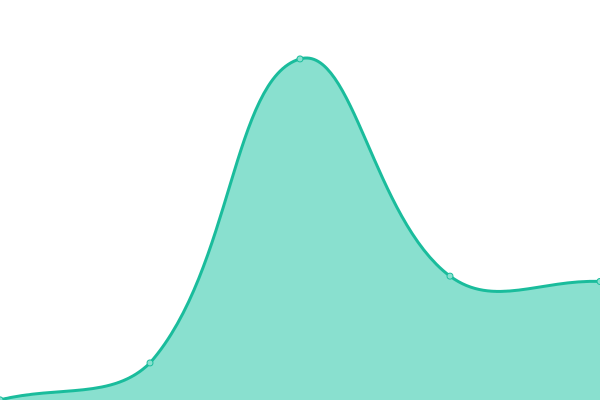 0ms
     
 | 

<a href="https://lacabra23.github.io/upptime/history/corporacion-de-acueducto-y-alcantarillado-de-moca-coraamoca">100.00%</a>
    

|  [Corporación de Acueducto y Alcantarillado de Montecristi (CORAMON)](https://coramon.gob.do) | 🟩 Up | [corporacion-de-acueducto-y-alcantarillado-de-montecristi-coramon.yml](https://github.com/lacabra23/upptime/commits/HEAD/history/corporacion-de-acueducto-y-alcantarillado-de-montecristi-coramon.yml) | 

 1699ms
     
 | 

<a href="https://lacabra23.github.io/upptime/history/corporacion-de-acueducto-y-alcantarillado-de-montecristi-coramon">100.00%</a>
    

|  [Corporación de Acueducto y Alcantarillado de Puerto Plata (CORAAPPLATA)](https://coraapplata.gob.do) | 🟩 Up | [corporacion-de-acueducto-y-alcantarillado-de-puerto-plata-coraapplata.yml](https://github.com/lacabra23/upptime/commits/HEAD/history/corporacion-de-acueducto-y-alcantarillado-de-puerto-plata-coraapplata.yml) | 

 0ms
     
 | 

<a href="https://lacabra23.github.io/upptime/history/corporacion-de-acueducto-y-alcantarillado-de-puerto-plata-coraapplata">100.00%</a>
    

|  [Corporación de Acueducto y Alcantarillado de Santiago (CORAASAN)](https://coraasan.gob.do) | 🟥 Down | [corporacion-de-acueducto-y-alcantarillado-de-santiago-coraasan.yml](https://github.com/lacabra23/upptime/commits/HEAD/history/corporacion-de-acueducto-y-alcantarillado-de-santiago-coraasan.yml) | 

 0ms
     
 | 

<a href="https://lacabra23.github.io/upptime/history/corporacion-de-acueducto-y-alcantarillado-de-santiago-coraasan">100.00%</a>
    

|  [Corporación del Acueducto y Alcantarillado de Santo Domingo (CAASD)](https://portal.caasd.gob.do) | 🟩 Up | [corporacion-del-acueducto-y-alcantarillado-de-santo-domingo-caasd.yml](https://github.com/lacabra23/upptime/commits/HEAD/history/corporacion-del-acueducto-y-alcantarillado-de-santo-domingo-caasd.yml) | 

 0ms
     
 | 

<a href="https://lacabra23.github.io/upptime/history/corporacion-del-acueducto-y-alcantarillado-de-santo-domingo-caasd">100.00%</a>
    

|  [Consejo Nacional de Discapacidad (CONADIS)](https://conadis.gob.do) | 🟩 Up | [consejo-nacional-de-discapacidad-conadis.yml](https://github.com/lacabra23/upptime/commits/HEAD/history/consejo-nacional-de-discapacidad-conadis.yml) | 

 0ms
     
 | 

<a href="https://lacabra23.github.io/upptime/history/consejo-nacional-de-discapacidad-conadis">100.00%</a>
    

|  [Consejo Nacional de Drogas](https://consejodedrogasrd.gob.do) | 🟩 Up | [consejo-nacional-de-drogas.yml](https://github.com/lacabra23/upptime/commits/HEAD/history/consejo-nacional-de-drogas.yml) | 

 0ms
     
 | 

<a href="https://lacabra23.github.io/upptime/history/consejo-nacional-de-drogas">100.00%</a>
    

|  [Dirección General de Desarrollo Fronterizo](https://fronteras.gob.do) | 🟩 Up | [direccion-general-de-desarrollo-fronterizo.yml](https://github.com/lacabra23/upptime/commits/HEAD/history/direccion-general-de-desarrollo-fronterizo.yml) | 

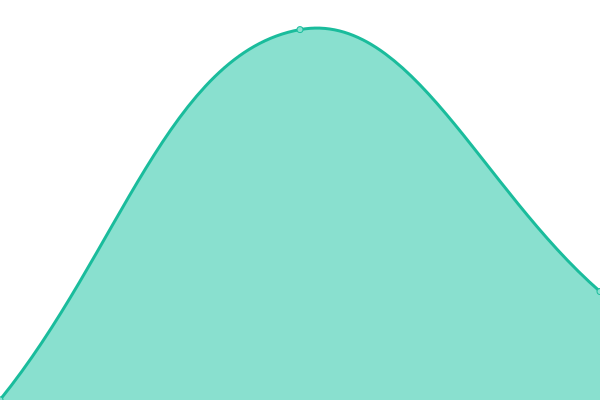 0ms
     
 | 

<a href="https://lacabra23.github.io/upptime/history/direccion-general-de-desarrollo-fronterizo">5.88%</a>
    

|  [Consejo Nacional de Investigaciones Agropecuarias y Forestales (CONIAF)](https://coniaf.gob.do) | 🟩 Up | [consejo-nacional-de-investigaciones-agropecuarias-y-forestales-coniaf.yml](https://github.com/lacabra23/upptime/commits/HEAD/history/consejo-nacional-de-investigaciones-agropecuarias-y-forestales-coniaf.yml) | 

 0ms
     
 | 

<a href="https://lacabra23.github.io/upptime/history/consejo-nacional-de-investigaciones-agropecuarias-y-forestales-coniaf">100.00%</a>
    

|  [Consejo Nacional de la Persona Envejeciente (CONAPE)](https://conape.gob.do) | 🟩 Up | [consejo-nacional-de-la-persona-envejeciente-conape.yml](https://github.com/lacabra23/upptime/commits/HEAD/history/consejo-nacional-de-la-persona-envejeciente-conape.yml) | 

 0ms
     
 | 

<a href="https://lacabra23.github.io/upptime/history/consejo-nacional-de-la-persona-envejeciente-conape">5.89%</a>
    

|  [Consejo Nacional de Protección a la Persona Envejeciente (CONAPROPE)](https://conaprope.gob.do) | 🟩 Up | [consejo-nacional-de-proteccion-a-la-persona-envejeciente-conaprope.yml](https://github.com/lacabra23/upptime/commits/HEAD/history/consejo-nacional-de-proteccion-a-la-persona-envejeciente-conaprope.yml) | 

 0ms
     
 | 

<a href="https://lacabra23.github.io/upptime/history/consejo-nacional-de-proteccion-a-la-persona-envejeciente-conaprope">100.00%</a>
    

|  [Consejo Nacional de Promoción y Apoyo a la Micro Pequeña y Mediana Empresa (PROMIPYME)](https://promipyme.gob.do) | 🟩 Up | [consejo-nacional-de-promocion-y-apoyo-a-la-micro-pequena-y-mediana-empresa-promipyme.yml](https://github.com/lacabra23/upptime/commits/HEAD/history/consejo-nacional-de-promocion-y-apoyo-a-la-micro-pequena-y-mediana-empresa-promipyme.yml) | 

 0ms
     
 | 

<a href="https://lacabra23.github.io/upptime/history/consejo-nacional-de-promocion-y-apoyo-a-la-micro-pequena-y-mediana-empresa-promipyme">100.00%</a>
    

|  [Consejo Nacional de Seguridad Social (CNSS)](https://cnss.gob.do) | 🟩 Up | [consejo-nacional-de-seguridad-social-cnss.yml](https://github.com/lacabra23/upptime/commits/HEAD/history/consejo-nacional-de-seguridad-social-cnss.yml) | 

 0ms
     
 | 

<a href="https://lacabra23.github.io/upptime/history/consejo-nacional-de-seguridad-social-cnss">100.00%</a>
    

|  [Consejo Nacional de Zonas Francas de Exportación (CNZFE)](https://cnzfe.gob.do) | 🟩 Up | [consejo-nacional-de-zonas-francas-de-exportacion-cnzfe.yml](https://github.com/lacabra23/upptime/commits/HEAD/history/consejo-nacional-de-zonas-francas-de-exportacion-cnzfe.yml) | 

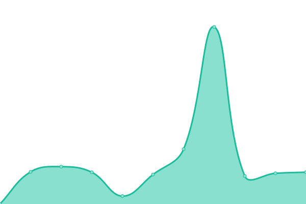 0ms
     
 | 

<a href="https://lacabra23.github.io/upptime/history/consejo-nacional-de-zonas-francas-de-exportacion-cnzfe">100.00%</a>
    

|  [Consejo Nacional para el Cambio Climático y Mecanismo de Desarrollo Limpio](https://cambioclimatico.gob.do) | 🟩 Up | [consejo-nacional-para-el-cambio-climatico-y-mecanismo-de-desarrollo-limpio.yml](https://github.com/lacabra23/upptime/commits/HEAD/history/consejo-nacional-para-el-cambio-climatico-y-mecanismo-de-desarrollo-limpio.yml) | 

 0ms
     
 | 

<a href="https://lacabra23.github.io/upptime/history/consejo-nacional-para-el-cambio-climatico-y-mecanismo-de-desarrollo-limpio">100.00%</a>
    

|  [Consejo Nacional para el VIH y el SIDA (CONAVIHSIDA)](https://conavihsida.gob.do) | 🟩 Up | [consejo-nacional-para-el-vih-y-el-sida-conavihsida.yml](https://github.com/lacabra23/upptime/commits/HEAD/history/consejo-nacional-para-el-vih-y-el-sida-conavihsida.yml) | 

 0ms
     
 | 

<a href="https://lacabra23.github.io/upptime/history/consejo-nacional-para-el-vih-y-el-sida-conavihsida">100.00%</a>
    

|  [Consejo Nacional para la Niñez y la Adolescencia (CONANI)](https://conani.gob.do) | 🟩 Up | [consejo-nacional-para-la-ninez-y-la-adolescencia-conani.yml](https://github.com/lacabra23/upptime/commits/HEAD/history/consejo-nacional-para-la-ninez-y-la-adolescencia-conani.yml) | 

 0ms
     
 | 

<a href="https://lacabra23.github.io/upptime/history/consejo-nacional-para-la-ninez-y-la-adolescencia-conani">100.00%</a>
    

|  [Consejo Nacional para la Reglamentación y Fomento de la Industria Lechera (CONALECHE)](https://conaleche.gob.do) | 🟩 Up | [consejo-nacional-para-la-reglamentacion-y-fomento-de-la-industria-lechera-conaleche.yml](https://github.com/lacabra23/upptime/commits/HEAD/history/consejo-nacional-para-la-reglamentacion-y-fomento-de-la-industria-lechera-conaleche.yml) | 

 0ms
     
 | 

<a href="https://lacabra23.github.io/upptime/history/consejo-nacional-para-la-reglamentacion-y-fomento-de-la-industria-lechera-conaleche">100.00%</a>
    

|  [Fondo de Mitigación de Riesgos Agropecuarios (FOMISAR)](https://fomisar.gob.do) | 🟩 Up | [fondo-de-mitigacion-de-riesgos-agropecuarios-fomisar.yml](https://github.com/lacabra23/upptime/commits/HEAD/history/fondo-de-mitigacion-de-riesgos-agropecuarios-fomisar.yml) | 

 0ms
     
 | 

<a href="https://lacabra23.github.io/upptime/history/fondo-de-mitigacion-de-riesgos-agropecuarios-fomisar">100.00%</a>
    

|  [Consultoría Jurídica del Poder Ejecutivo](https://consultoria.gov.do) | 🟩 Up | [consultoria-juridica-del-poder-ejecutivo.yml](https://github.com/lacabra23/upptime/commits/HEAD/history/consultoria-juridica-del-poder-ejecutivo.yml) | 

 0ms
     
 | 

<a href="https://lacabra23.github.io/upptime/history/consultoria-juridica-del-poder-ejecutivo">100.00%</a>
    

|  [Corporación de Fomento de la Industria Hotelera y Desarrollo del Turismo (CORPHOTELS)](https://corphotels.gob.do) | 🟩 Up | [corporacion-de-fomento-de-la-industria-hotelera-y-desarrollo-del-turismo-corphotels.yml](https://github.com/lacabra23/upptime/commits/HEAD/history/corporacion-de-fomento-de-la-industria-hotelera-y-desarrollo-del-turismo-corphotels.yml) | 

 559ms
     
 | 

<a href="https://lacabra23.github.io/upptime/history/corporacion-de-fomento-de-la-industria-hotelera-y-desarrollo-del-turismo-corphotels">100.00%</a>
    

|  [Dirección General de Bellas Artes](https://bellasartesrd.gob.do) | 🟩 Up | [direccion-general-de-bellas-artes.yml](https://github.com/lacabra23/upptime/commits/HEAD/history/direccion-general-de-bellas-artes.yml) | 

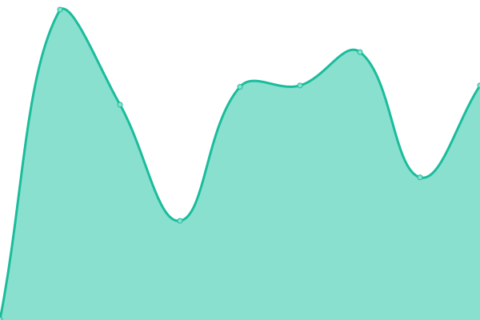 0ms
     
 | 

<a href="https://lacabra23.github.io/upptime/history/direccion-general-de-bellas-artes">100.00%</a>
    

|  [Banco Nacional de Fomento de la Vivienda y la Producción (BNV)](https://bn.gob.do) | 🟩 Up | [banco-nacional-de-fomento-de-la-vivienda-y-la-produccion-bnv.yml](https://github.com/lacabra23/upptime/commits/HEAD/history/banco-nacional-de-fomento-de-la-vivienda-y-la-produccion-bnv.yml) | 

 0ms
     
 | 

<a href="https://lacabra23.github.io/upptime/history/banco-nacional-de-fomento-de-la-vivienda-y-la-produccion-bnv">100.00%</a>
    

|  [Dirección General de Catastro Nacional](https://catastro.gob.do) | 🟩 Up | [direccion-general-de-catastro-nacional.yml](https://github.com/lacabra23/upptime/commits/HEAD/history/direccion-general-de-catastro-nacional.yml) | 

 0ms
     
 | 

<a href="https://lacabra23.github.io/upptime/history/direccion-general-de-catastro-nacional">0.00%</a>
    

|  [Dirección General de Cine (DGCINE)](https://dgcine.gob.do) | 🟩 Up | [direccion-general-de-cine-dgcine.yml](https://github.com/lacabra23/upptime/commits/HEAD/history/direccion-general-de-cine-dgcine.yml) | 

 0ms
     
 | 

<a href="https://lacabra23.github.io/upptime/history/direccion-general-de-cine-dgcine">0.00%</a>
    

|  [Dirección General de Contabilidad Gubernamental (DIGECOG)](https://digecog.gob.do) | 🟩 Up | [direccion-general-de-contabilidad-gubernamental-digecog.yml](https://github.com/lacabra23/upptime/commits/HEAD/history/direccion-general-de-contabilidad-gubernamental-digecog.yml) | 

 1129ms
     
 | 

<a href="https://lacabra23.github.io/upptime/history/direccion-general-de-contabilidad-gubernamental-digecog">100.00%</a>
    

|  [Dirección General de Contrataciones Públicas (DGCP)](https://dgcp.gob.do) | 🟩 Up | [direccion-general-de-contrataciones-publicas-dgcp.yml](https://github.com/lacabra23/upptime/commits/HEAD/history/direccion-general-de-contrataciones-publicas-dgcp.yml) | 

 0ms
     
 | 

<a href="https://lacabra23.github.io/upptime/history/direccion-general-de-contrataciones-publicas-dgcp">100.00%</a>
    

|  [Dirección General de Desarrollo de la Comunidad (DGDC)](https://dgdc.gob.do) | 🟩 Up | [direccion-general-de-desarrollo-de-la-comunidad-dgdc.yml](https://github.com/lacabra23/upptime/commits/HEAD/history/direccion-general-de-desarrollo-de-la-comunidad-dgdc.yml) | 

 0ms
     
 | 

<a href="https://lacabra23.github.io/upptime/history/direccion-general-de-desarrollo-de-la-comunidad-dgdc">100.00%</a>
    

|  [Dirección General de Desarrollo Fronterizo (DGDF)](https://dgdf.gob.do) | 🟩 Up | [direccion-general-de-desarrollo-fronterizo-dgdf.yml](https://github.com/lacabra23/upptime/commits/HEAD/history/direccion-general-de-desarrollo-fronterizo-dgdf.yml) | 

 3681ms
     
 | 

<a href="https://lacabra23.github.io/upptime/history/direccion-general-de-desarrollo-fronterizo-dgdf">98.09%</a>
    

|  [Dirección General de Educación y Capacitación en Ciencias Agropecuarias (DIGECAC)](https://digecac.gob.do) | 🟩 Up | [direccion-general-de-educacion-y-capacitacion-en-ciencias-agropecuarias-digecac.yml](https://github.com/lacabra23/upptime/commits/HEAD/history/direccion-general-de-educacion-y-capacitacion-en-ciencias-agropecuarias-digecac.yml) | 

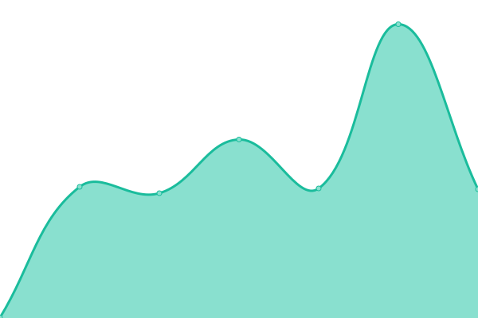 0ms
     
 | 

<a href="https://lacabra23.github.io/upptime/history/direccion-general-de-educacion-y-capacitacion-en-ciencias-agropecuarias-digecac">100.00%</a>
    

|  [Dirección General de Ganadería](https://ganaderia.gob.do) | 🟩 Up | [direccion-general-de-ganaderia.yml](https://github.com/lacabra23/upptime/commits/HEAD/history/direccion-general-de-ganaderia.yml) | 

 0ms
     
 | 

<a href="https://lacabra23.github.io/upptime/history/direccion-general-de-ganaderia">23.56%</a>
    

|  [Dirección General de Ética e Integridad Gubernamental (DIGEIG)](https://digeig.gob.do) | 🟩 Up | [direccion-general-de-etica-e-integridad-gubernamental-digeig.yml](https://github.com/lacabra23/upptime/commits/HEAD/history/direccion-general-de-etica-e-integridad-gubernamental-digeig.yml) | 

 0ms
     
 | 

<a href="https://lacabra23.github.io/upptime/history/direccion-general-de-etica-e-integridad-gubernamental-digeig">100.00%</a>
    

|  [Dirección de Información y Defensa de los Afiliados a la Seguridad Social (DIDA)](https://dida.gob.do) | 🟩 Up | [direccion-de-informacion-y-defensa-de-los-afiliados-a-la-seguridad-social-dida.yml](https://github.com/lacabra23/upptime/commits/HEAD/history/direccion-de-informacion-y-defensa-de-los-afiliados-a-la-seguridad-social-dida.yml) | 

 0ms
     
 | 

<a href="https://lacabra23.github.io/upptime/history/direccion-de-informacion-y-defensa-de-los-afiliados-a-la-seguridad-social-dida">100.00%</a>
    

|  [Dirección General de Jubilaciones y Pensiones (DGJP)](https://dgjp.gob.do) | 🟥 Down | [direccion-general-de-jubilaciones-y-pensiones-dgjp.yml](https://github.com/lacabra23/upptime/commits/HEAD/history/direccion-general-de-jubilaciones-y-pensiones-dgjp.yml) | 

 0ms
     
 | 

<a href="https://lacabra23.github.io/upptime/history/direccion-general-de-jubilaciones-y-pensiones-dgjp">0.00%</a>
    

|  [Dirección General de Minería](https://mineria.gob.do) | 🟥 Down | [direccion-general-de-mineria.yml](https://github.com/lacabra23/upptime/commits/HEAD/history/direccion-general-de-mineria.yml) | 

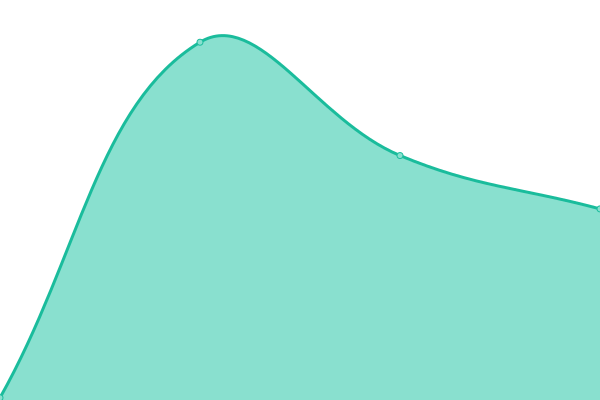 0ms
     
 | 

<a href="https://lacabra23.github.io/upptime/history/direccion-general-de-mineria">0.00%</a>
    

|  [Dirección General de Migración (DGM)](https://dgm.gob.do) | 🟩 Up | [direccion-general-de-migracion-dgm.yml](https://github.com/lacabra23/upptime/commits/HEAD/history/direccion-general-de-migracion-dgm.yml) | 

 1398ms
     
 | 

<a href="https://lacabra23.github.io/upptime/history/direccion-general-de-migracion-dgm">52.05%</a>
    

|  [Dirección General de Pasaportes](https://solicitudweb.pasaportes.gob.do) | 🟩 Up | [direccion-general-de-pasaportes.yml](https://github.com/lacabra23/upptime/commits/HEAD/history/direccion-general-de-pasaportes.yml) | 

 1836ms
     
 | 

<a href="https://lacabra23.github.io/upptime/history/direccion-general-de-pasaportes">99.03%</a>
    

|  [Dirección General de Presupuesto (DIGEPRES)](https://digepres.gob.do) | 🟥 Down | [direccion-general-de-presupuesto-digepres.yml](https://github.com/lacabra23/upptime/commits/HEAD/history/direccion-general-de-presupuesto-digepres.yml) | 

 0ms
     
 | 

<a href="https://lacabra23.github.io/upptime/history/direccion-general-de-presupuesto-digepres">0.00%</a>
    

|  [Dirección General de Proyectos Estratégicos y Especiales de la Presidencia (PROPEEP)](https://propeep.gob.do) | 🟩 Up | [direccion-general-de-proyectos-estrategicos-y-especiales-de-la-presidencia-propeep.yml](https://github.com/lacabra23/upptime/commits/HEAD/history/direccion-general-de-proyectos-estrategicos-y-especiales-de-la-presidencia-propeep.yml) | 

 3539ms
     
 | 

<a href="https://lacabra23.github.io/upptime/history/direccion-general-de-proyectos-estrategicos-y-especiales-de-la-presidencia-propeep">100.00%</a>
    

|  [Dirección General de Rehabilitación (DIGERA)](https://digera.gob.do) | 🟩 Up | [direccion-general-de-rehabilitacion-digera.yml](https://github.com/lacabra23/upptime/commits/HEAD/history/direccion-general-de-rehabilitacion-digera.yml) | 

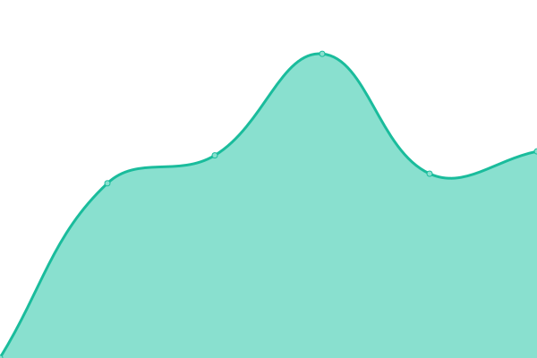 0ms
     
 | 

<a href="https://lacabra23.github.io/upptime/history/direccion-general-de-rehabilitacion-digera">100.00%</a>
    

|  [Dirección Nacional de Control de Drogas (DNCD)](https://dncd.gob.do) | 🟩 Up | [direccion-nacional-de-control-de-drogas-dncd.yml](https://github.com/lacabra23/upptime/commits/HEAD/history/direccion-nacional-de-control-de-drogas-dncd.yml) | 

 0ms
     
 | 

<a href="https://lacabra23.github.io/upptime/history/direccion-nacional-de-control-de-drogas-dncd">100.00%</a>
    

|  [Fondo de Pensiones de los Trabajadores de la Construcción (FOPETCONS)](https://fopetcons.gob.do) | 🟥 Down | [fondo-de-pensiones-de-los-trabajadores-de-la-construccion-fopetcons.yml](https://github.com/lacabra23/upptime/commits/HEAD/history/fondo-de-pensiones-de-los-trabajadores-de-la-construccion-fopetcons.yml) | 

 0ms
     
 | 

<a href="https://lacabra23.github.io/upptime/history/fondo-de-pensiones-de-los-trabajadores-de-la-construccion-fopetcons">100.00%</a>
    

|  [Fondo Especial para el Desarrollo Agropecuario (FEDA)](https://feda.gob.do) | 🟥 Down | [fondo-especial-para-el-desarrollo-agropecuario-feda.yml](https://github.com/lacabra23/upptime/commits/HEAD/history/fondo-especial-para-el-desarrollo-agropecuario-feda.yml) | 

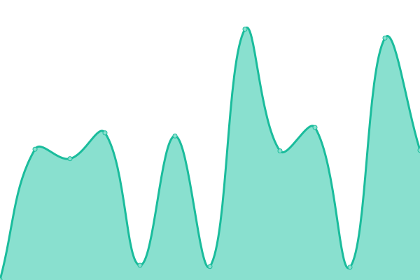 0ms
     
 | 

<a href="https://lacabra23.github.io/upptime/history/fondo-especial-para-el-desarrollo-agropecuario-feda">100.00%</a>
    

|  [Fondo Marena](https://fondomarena.gob.do) | 🟩 Up | [fondo-marena.yml](https://github.com/lacabra23/upptime/commits/HEAD/history/fondo-marena.yml) | 

 685ms
     
 | 

<a href="https://lacabra23.github.io/upptime/history/fondo-marena">93.58%</a>
    

|  [Fondo Patrimonial de las Empresas Reformadas (FONPER)](https://fonper.gob.do) | 🟩 Up | [fondo-patrimonial-de-las-empresas-reformadas-fonper.yml](https://github.com/lacabra23/upptime/commits/HEAD/history/fondo-patrimonial-de-las-empresas-reformadas-fonper.yml) | 

 0ms
     
 | 

<a href="https://lacabra23.github.io/upptime/history/fondo-patrimonial-de-las-empresas-reformadas-fonper">100.00%</a>
    

|  [Gabinete de Política Social](gabinetesocial.gob.do) | 🟥 Down | [gabinete-de-politica-social.yml](https://github.com/lacabra23/upptime/commits/HEAD/history/gabinete-de-politica-social.yml) | 

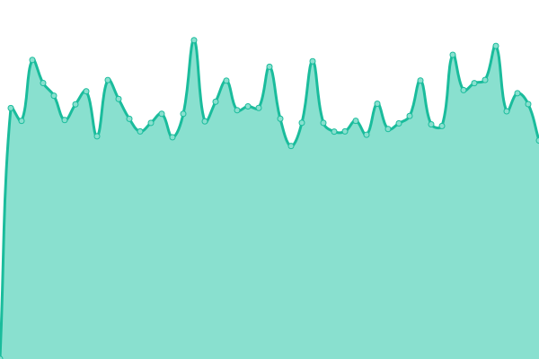 2120ms
     
 | 

<a href="https://lacabra23.github.io/upptime/history/gabinete-de-politica-social">4.06%</a>
    

|  [Instituto Nacional de la Aguja (INAGUJA)](https://inaguja.gob.do) | 🟩 Up | [instituto-nacional-de-la-aguja-inaguja.yml](https://github.com/lacabra23/upptime/commits/HEAD/history/instituto-nacional-de-la-aguja-inaguja.yml) | 

 0ms
     
 | 

<a href="https://lacabra23.github.io/upptime/history/instituto-nacional-de-la-aguja-inaguja">23.56%</a>
    

|  [Instituto Agrario Dominicano (IAD)](https://iad.gob.do) | 🟩 Up | [instituto-agrario-dominicano-iad.yml](https://github.com/lacabra23/upptime/commits/HEAD/history/instituto-agrario-dominicano-iad.yml) | 

 5629ms
     
 | 

<a href="https://lacabra23.github.io/upptime/history/instituto-agrario-dominicano-iad">46.10%</a>
    

|  [Instituto Nacional del Azúcar (INAZUCAR)](https://inazucar.gov.do) | 🟩 Up | [instituto-nacional-del-azucar-inazucar.yml](https://github.com/lacabra23/upptime/commits/HEAD/history/instituto-nacional-del-azucar-inazucar.yml) | 

 0ms
     
 | 

<a href="https://lacabra23.github.io/upptime/history/instituto-nacional-del-azucar-inazucar">100.00%</a>
    

|  [Instituto Nacional de la Vivienda (INAVI)](https://inavi.gob.do) | 🟩 Up | [instituto-nacional-de-la-vivienda-inavi.yml](https://github.com/lacabra23/upptime/commits/HEAD/history/instituto-nacional-de-la-vivienda-inavi.yml) | 

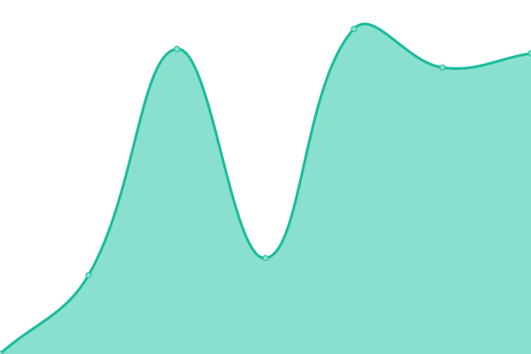 1088ms
     
 | 

<a href="https://lacabra23.github.io/upptime/history/instituto-nacional-de-la-vivienda-inavi">7.28%</a>
    

|  [Instituto de Desarrollo y Crédito Cooperativo (IDECOOP)](https://idecoop.gob.do) | 🟩 Up | [instituto-de-desarrollo-y-credito-cooperativo-idecoop.yml](https://github.com/lacabra23/upptime/commits/HEAD/history/instituto-de-desarrollo-y-credito-cooperativo-idecoop.yml) | 

 2315ms
     
 | 

<a href="https://lacabra23.github.io/upptime/history/instituto-de-desarrollo-y-credito-cooperativo-idecoop">100.00%</a>
    

|  [Instituto de Estabilización de Precios (INESPRE)](https://inespre.gob.do) | 🟩 Up | [instituto-de-estabilizacion-de-precios-inespre.yml](https://github.com/lacabra23/upptime/commits/HEAD/history/instituto-de-estabilizacion-de-precios-inespre.yml) | 

 0ms
     
 | 

<a href="https://lacabra23.github.io/upptime/history/instituto-de-estabilizacion-de-precios-inespre">100.00%</a>
    

|  [Instituto de Innovación en Biotecnología e Industria (IIBI)](https://iibi.gob.do) | 🟩 Up | [instituto-de-innovacion-en-biotecnologia-e-industria-iibi.yml](https://github.com/lacabra23/upptime/commits/HEAD/history/instituto-de-innovacion-en-biotecnologia-e-industria-iibi.yml) | 

 0ms
     
 | 

<a href="https://lacabra23.github.io/upptime/history/instituto-de-innovacion-en-biotecnologia-e-industria-iibi">100.00%</a>
    

|  [Instituto del Tabaco de la República Dominicana (INTABACO)](https://intabaco.gob.do) | 🟩 Up | [instituto-del-tabaco-de-la-republica-dominicana-intabaco.yml](https://github.com/lacabra23/upptime/commits/HEAD/history/instituto-del-tabaco-de-la-republica-dominicana-intabaco.yml) | 

 0ms
     
 | 

<a href="https://lacabra23.github.io/upptime/history/instituto-del-tabaco-de-la-republica-dominicana-intabaco">100.00%</a>
    

|  [Instituto Dominicano de Aviación Civil (IDAC)](https://idac.gob.do) | 🟩 Up | [instituto-dominicano-de-aviacion-civil-idac.yml](https://github.com/lacabra23/upptime/commits/HEAD/history/instituto-dominicano-de-aviacion-civil-idac.yml) | 

 3317ms
     
 | 

<a href="https://lacabra23.github.io/upptime/history/instituto-dominicano-de-aviacion-civil-idac">100.00%</a>
    

|  [Instituto Dominicano de Evaluación e Investigación de la Calidad Educativa (IDEICE)](https://ideice.gob.do) | 🟩 Up | [instituto-dominicano-de-evaluacion-e-investigacion-de-la-calidad-educativa-ideice.yml](https://github.com/lacabra23/upptime/commits/HEAD/history/instituto-dominicano-de-evaluacion-e-investigacion-de-la-calidad-educativa-ideice.yml) | 

 0ms
     
 | 

<a href="https://lacabra23.github.io/upptime/history/instituto-dominicano-de-evaluacion-e-investigacion-de-la-calidad-educativa-ideice">100.00%</a>
    

|  [Instituto Dominicano de Investigaciones Agropecuarias y Forestales (IDIAF)](https://idiaf.gob.do) | 🟩 Up | [instituto-dominicano-de-investigaciones-agropecuarias-y-forestales-idiaf.yml](https://github.com/lacabra23/upptime/commits/HEAD/history/instituto-dominicano-de-investigaciones-agropecuarias-y-forestales-idiaf.yml) | 

 0ms
     
 | 

<a href="https://lacabra23.github.io/upptime/history/instituto-dominicano-de-investigaciones-agropecuarias-y-forestales-idiaf">100.00%</a>
    

|  [Oficina Nacional de Meteorología (ONAMET)](https://onamet.gob.do) | 🟩 Up | [oficina-nacional-de-meteorologia-onamet.yml](https://github.com/lacabra23/upptime/commits/HEAD/history/oficina-nacional-de-meteorologia-onamet.yml) | 

 0ms
     
 | 

<a href="https://lacabra23.github.io/upptime/history/oficina-nacional-de-meteorologia-onamet">100.00%</a>
    

|  [Instituto Dominicano de Prevención y Protección de Riesgos Laborales (IDOPPRIL)](https://idoppril.gob.do) | 🟥 Down | [instituto-dominicano-de-prevencion-y-proteccion-de-riesgos-laborales-idoppril.yml](https://github.com/lacabra23/upptime/commits/HEAD/history/instituto-dominicano-de-prevencion-y-proteccion-de-riesgos-laborales-idoppril.yml) | 

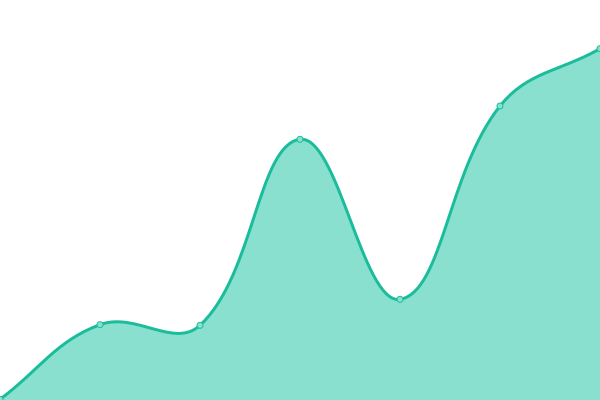 234ms
     
 | 

<a href="https://lacabra23.github.io/upptime/history/instituto-dominicano-de-prevencion-y-proteccion-de-riesgos-laborales-idoppril">100.00%</a>
    

|  [Instituto Dominicano para la Calidad (INDOCAL)](https://indocal.gob.do) | 🟩 Up | [instituto-dominicano-para-la-calidad-indocal.yml](https://github.com/lacabra23/upptime/commits/HEAD/history/instituto-dominicano-para-la-calidad-indocal.yml) | 

 0ms
     
 | 

<a href="https://lacabra23.github.io/upptime/history/instituto-dominicano-para-la-calidad-indocal">100.00%</a>
    

|  [Instituto Duartiano](https://institutoduartiano.gob.do) | 🟩 Up | [instituto-duartiano.yml](https://github.com/lacabra23/upptime/commits/HEAD/history/instituto-duartiano.yml) | 

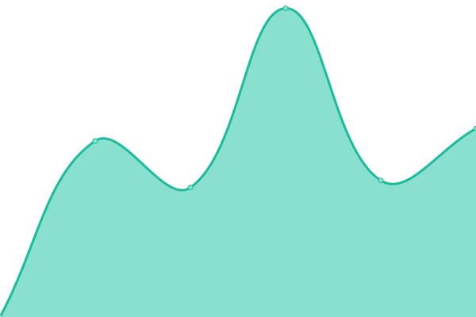 2705ms
     
 | 

<a href="https://lacabra23.github.io/upptime/history/instituto-duartiano">21.80%</a>
    

|  [Instituto Geográfico Nacional (IGN)](https://ign.gob.do) | 🟩 Up | [instituto-geografico-nacional-ign.yml](https://github.com/lacabra23/upptime/commits/HEAD/history/instituto-geografico-nacional-ign.yml) | 

 381ms
     
 | 

<a href="https://lacabra23.github.io/upptime/history/instituto-geografico-nacional-ign">11.09%</a>
    

|  [Instituto Nacional de Capacitación y Formación del Personal de la Industria de la Construcción (INCABIDE)](https://incabide.gob.do) | 🟩 Up | [instituto-nacional-de-capacitacion-y-formacion-del-personal-de-la-industria-de-la-construccion-incabide.yml](https://github.com/lacabra23/upptime/commits/HEAD/history/instituto-nacional-de-capacitacion-y-formacion-del-personal-de-la-industria-de-la-construccion-incabide.yml) | 

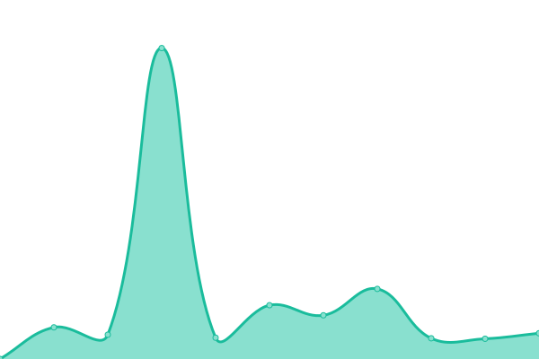 0ms
     
 | 

<a href="https://lacabra23.github.io/upptime/history/instituto-nacional-de-capacitacion-y-formacion-del-personal-de-la-industria-de-la-construccion-incabide">100.00%</a>
    

|  [Instituto Nacional de Educación Física (INEFI)](https://inefi.gob.do) | 🟩 Up | [instituto-nacional-de-educacion-fisica-inefi.yml](https://github.com/lacabra23/upptime/commits/HEAD/history/instituto-nacional-de-educacion-fisica-inefi.yml) | 

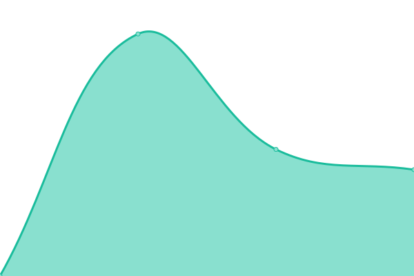 0ms
     
 | 

<a href="https://lacabra23.github.io/upptime/history/instituto-nacional-de-educacion-fisica-inefi">0.00%</a>
    

|  [Instituto Nacional de Formación Técnico Profesional (INFOTEP)](https://infotep.gob.do) | 🟥 Down | [instituto-nacional-de-formacion-tecnico-profesional-infotep.yml](https://github.com/lacabra23/upptime/commits/HEAD/history/instituto-nacional-de-formacion-tecnico-profesional-infotep.yml) | 

 0ms
     
 | 

<a href="https://lacabra23.github.io/upptime/history/instituto-nacional-de-formacion-tecnico-profesional-infotep">100.00%</a>
    

|  [Instituto Nacional de Migración (INM)](https://inm.gob.do) | 🟩 Up | [instituto-nacional-de-migracion-inm.yml](https://github.com/lacabra23/upptime/commits/HEAD/history/instituto-nacional-de-migracion-inm.yml) | 

 0ms
     
 | 

<a href="https://lacabra23.github.io/upptime/history/instituto-nacional-de-migracion-inm">0.00%</a>
    

|  [Instituto Nacional de Protección de los Derechos del Consumidor (Pro Consumidor)](https://proconsumidor.gob.do) | 🟩 Up | [instituto-nacional-de-proteccion-de-los-derechos-del-consumidor-pro-consumidor.yml](https://github.com/lacabra23/upptime/commits/HEAD/history/instituto-nacional-de-proteccion-de-los-derechos-del-consumidor-pro-consumidor.yml) | 

 0ms
     
 | 

<a href="https://lacabra23.github.io/upptime/history/instituto-nacional-de-proteccion-de-los-derechos-del-consumidor-pro-consumidor">100.00%</a>
    

|  [Instituto Nacional de Recursos Hidráulicos (INDRHI)](https://indrhi.gob.do) | 🟩 Up | [instituto-nacional-de-recursos-hidraulicos-indrhi.yml](https://github.com/lacabra23/upptime/commits/HEAD/history/instituto-nacional-de-recursos-hidraulicos-indrhi.yml) | 

 0ms
     
 | 

<a href="https://lacabra23.github.io/upptime/history/instituto-nacional-de-recursos-hidraulicos-indrhi">5.94%</a>
    

|  [Instituto Nacional de Tránsito y Transporte Terrestre (INTRANT)](https://intrant.gob.do) | 🟩 Up | [instituto-nacional-de-transito-y-transporte-terrestre-intrant.yml](https://github.com/lacabra23/upptime/commits/HEAD/history/instituto-nacional-de-transito-y-transporte-terrestre-intrant.yml) | 

 731ms
     
 | 

<a href="https://lacabra23.github.io/upptime/history/instituto-nacional-de-transito-y-transporte-terrestre-intrant">100.00%</a>
    

|  [Instituto Postal Dominicano (INPOSDOM)](https://inposdom.gob.do) | 🟩 Up | [instituto-postal-dominicano-inposdom.yml](https://github.com/lacabra23/upptime/commits/HEAD/history/instituto-postal-dominicano-inposdom.yml) | 

 0ms
     
 | 

<a href="https://lacabra23.github.io/upptime/history/instituto-postal-dominicano-inposdom">100.00%</a>
    

|  [Jardín Botánico Nacional Dr. Rafael M. Moscoso (JBN)](https://jbn.gob.do) | 🟩 Up | [jardin-botanico-nacional-dr-rafael-m-moscoso-jbn.yml](https://github.com/lacabra23/upptime/commits/HEAD/history/jardin-botanico-nacional-dr-rafael-m-moscoso-jbn.yml) | 

 644ms
     
 | 

<a href="https://lacabra23.github.io/upptime/history/jardin-botanico-nacional-dr-rafael-m-moscoso-jbn">7.28%</a>
    

|  [Junta de Aviación Civil (JAC)](https://jac.gob.do) | 🟩 Up | [junta-de-aviacion-civil-jac.yml](https://github.com/lacabra23/upptime/commits/HEAD/history/junta-de-aviacion-civil-jac.yml) | 

 0ms
     
 | 

<a href="https://lacabra23.github.io/upptime/history/junta-de-aviacion-civil-jac">100.00%</a>
    

|  [Liga Municipal Dominicana (LMD)](https://lmd.gob.do) | 🟩 Up | [liga-municipal-dominicana-lmd.yml](https://github.com/lacabra23/upptime/commits/HEAD/history/liga-municipal-dominicana-lmd.yml) | 

 0ms
     
 | 

<a href="https://lacabra23.github.io/upptime/history/liga-municipal-dominicana-lmd">100.00%</a>
    

|  [Mercado Modelo de Santo Domingo](https://mercadom.gob.do) | 🟩 Up | [mercado-modelo-de-santo-domingo.yml](https://github.com/lacabra23/upptime/commits/HEAD/history/mercado-modelo-de-santo-domingo.yml) | 

 2375ms
     
 | 

<a href="https://lacabra23.github.io/upptime/history/mercado-modelo-de-santo-domingo">99.47%</a>
    

|  [Ministerio Administrativo de la Presidencia (MAPRE)](mapre.gob.do) | 🟥 Down | [ministerio-administrativo-de-la-presidencia-mapre.yml](https://github.com/lacabra23/upptime/commits/HEAD/history/ministerio-administrativo-de-la-presidencia-mapre.yml) | 

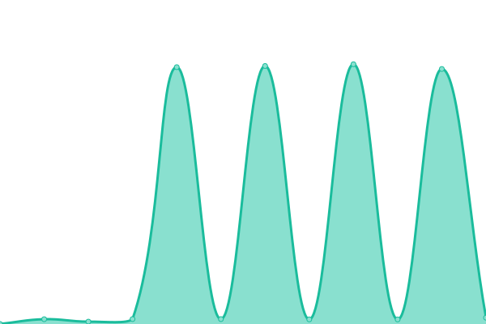 10128ms
     
 | 

<a href="https://lacabra23.github.io/upptime/history/ministerio-administrativo-de-la-presidencia-mapre">97.75%</a>
    

|  [Museo Nacional de Historia Natural Prof. Eugenio de Jesús Marcano (MNHN)](https://mnhn.gob.do) | 🟩 Up | [museo-nacional-de-historia-natural-prof-eugenio-de-jesus-marcano-mnhn.yml](https://github.com/lacabra23/upptime/commits/HEAD/history/museo-nacional-de-historia-natural-prof-eugenio-de-jesus-marcano-mnhn.yml) | 

 13521ms
     
 | 

<a href="https://lacabra23.github.io/upptime/history/museo-nacional-de-historia-natural-prof-eugenio-de-jesus-marcano-mnhn">100.00%</a>
    

|  [Defensa Civil Dominicana](https://defensacivil.gob.do) | 🟩 Up | [defensa-civil-dominicana.yml](https://github.com/lacabra23/upptime/commits/HEAD/history/defensa-civil-dominicana.yml) | 

 0ms
     
 | 

<a href="https://lacabra23.github.io/upptime/history/defensa-civil-dominicana">100.00%</a>
    

|  [Oficina Gubernamental de Tecnologías de la Información y Comunicación (OGTIC)](https://ogtic.gob.do) | 🟩 Up | [oficina-gubernamental-de-tecnologias-de-la-informacion-y-comunicacion-ogtic.yml](https://github.com/lacabra23/upptime/commits/HEAD/history/oficina-gubernamental-de-tecnologias-de-la-informacion-y-comunicacion-ogtic.yml) | 

 0ms
     
 | 

<a href="https://lacabra23.github.io/upptime/history/oficina-gubernamental-de-tecnologias-de-la-informacion-y-comunicacion-ogtic">100.00%</a>
    

|  [Oficina Nacional de Derecho de Autor (ONDA)](https://onda.gob.do) | 🟩 Up | [oficina-nacional-de-derecho-de-autor-onda.yml](https://github.com/lacabra23/upptime/commits/HEAD/history/oficina-nacional-de-derecho-de-autor-onda.yml) | 

 0ms
     
 | 

<a href="https://lacabra23.github.io/upptime/history/oficina-nacional-de-derecho-de-autor-onda">33.95%</a>
    

|  [Oficina Nacional de Estadística (ONE)](https://one.gob.do) | 🟩 Up | [oficina-nacional-de-estadistica-one.yml](https://github.com/lacabra23/upptime/commits/HEAD/history/oficina-nacional-de-estadistica-one.yml) | 

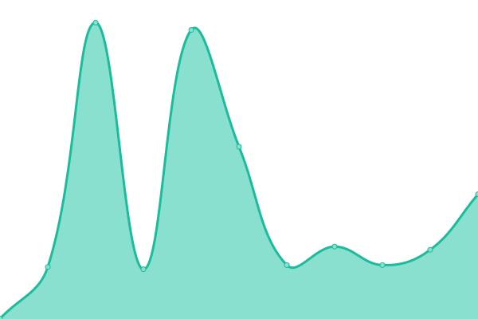 528ms
     
 | 

<a href="https://lacabra23.github.io/upptime/history/oficina-nacional-de-estadistica-one">61.17%</a>
    

|  [Oficina Nacional de Evaluación Sísmica y Vulnerabilidad de Infraestructura y Edificaciones (ONESVIE)](https://onesvie.gob.do) | 🟩 Up | [oficina-nacional-de-evaluacion-sismica-y-vulnerabilidad-de-infraestructura-y-edificaciones-onesvie.yml](https://github.com/lacabra23/upptime/commits/HEAD/history/oficina-nacional-de-evaluacion-sismica-y-vulnerabilidad-de-infraestructura-y-edificaciones-onesvie.yml) | 

 1238ms
     
 | 

<a href="https://lacabra23.github.io/upptime/history/oficina-nacional-de-evaluacion-sismica-y-vulnerabilidad-de-infraestructura-y-edificaciones-onesvie">100.00%</a>
    

|  [Oficina para el Reordenamiento del Transporte (OPRET)](https://opret.gob.do) | 🟥 Down | [oficina-para-el-reordenamiento-del-transporte-opret.yml](https://github.com/lacabra23/upptime/commits/HEAD/history/oficina-para-el-reordenamiento-del-transporte-opret.yml) | 

 0ms
     
 | 

<a href="https://lacabra23.github.io/upptime/history/oficina-para-el-reordenamiento-del-transporte-opret">100.00%</a>
    

|  [Organismo Dominicano de Acreditación (ODAC)](https://odac.gob.do) | 🟩 Up | [organismo-dominicano-de-acreditacion-odac.yml](https://github.com/lacabra23/upptime/commits/HEAD/history/organismo-dominicano-de-acreditacion-odac.yml) | 

 0ms
     
 | 

<a href="https://lacabra23.github.io/upptime/history/organismo-dominicano-de-acreditacion-odac">33.97%</a>
    

|  [Zoológico Nacional (ZOODOM)](https://zoodom.gob.do) | 🟩 Up | [zoologico-nacional-zoodom.yml](https://github.com/lacabra23/upptime/commits/HEAD/history/zoologico-nacional-zoodom.yml) | 

 0ms
     
 | 

<a href="https://lacabra23.github.io/upptime/history/zoologico-nacional-zoodom">33.98%</a>
    

|  [Programa de Medicamentos Esenciales y Central de Apoyo Logístico (PROMESE/CAL)](https://promesecal.gob.do) | 🟩 Up | [programa-de-medicamentos-esenciales-y-central-de-apoyo-logistico-promese-cal.yml](https://github.com/lacabra23/upptime/commits/HEAD/history/programa-de-medicamentos-esenciales-y-central-de-apoyo-logistico-promese-cal.yml) | 

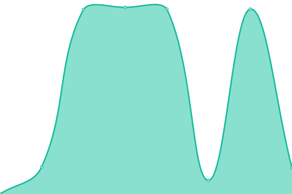 0ms
     
 | 

<a href="https://lacabra23.github.io/upptime/history/programa-de-medicamentos-esenciales-y-central-de-apoyo-logistico-promese-cal">100.00%</a>
    

|  [Programa de Protección Social Supérate](https://superate.gob.do) | 🟥 Down | [programa-de-proteccion-social-superate.yml](https://github.com/lacabra23/upptime/commits/HEAD/history/programa-de-proteccion-social-superate.yml) | 

 0ms
     
 | 

<a href="https://lacabra23.github.io/upptime/history/programa-de-proteccion-social-superate">0.00%</a>
    

|  [Servicio Geológico Nacional (SGN)](https://sgn.gob.do) | 🟩 Up | [servicio-geologico-nacional-sgn.yml](https://github.com/lacabra23/upptime/commits/HEAD/history/servicio-geologico-nacional-sgn.yml) | 

 0ms
     
 | 

<a href="https://lacabra23.github.io/upptime/history/servicio-geologico-nacional-sgn">0.00%</a>
    

|  [Sistema Único de Beneficiarios (SIUBEN)](https://siuben.gob.do) | 🟩 Up | [sistema-unico-de-beneficiarios-siuben.yml](https://github.com/lacabra23/upptime/commits/HEAD/history/sistema-unico-de-beneficiarios-siuben.yml) | 

 0ms
     
 | 

<a href="https://lacabra23.github.io/upptime/history/sistema-unico-de-beneficiarios-siuben">100.00%</a>
    

|  [Superintendencia de Electricidad (SIE)](https://sie.gob.do) | 🟩 Up | [superintendencia-de-electricidad-sie.yml](https://github.com/lacabra23/upptime/commits/HEAD/history/superintendencia-de-electricidad-sie.yml) | 

 0ms
     
 | 

<a href="https://lacabra23.github.io/upptime/history/superintendencia-de-electricidad-sie">100.00%</a>
    

|  [Superintendencia de Pensiones (SIPEN)](https://sipen.gob.do) | 🟩 Up | [superintendencia-de-pensiones-sipen.yml](https://github.com/lacabra23/upptime/commits/HEAD/history/superintendencia-de-pensiones-sipen.yml) | 

 1816ms
     
 | 

<a href="https://lacabra23.github.io/upptime/history/superintendencia-de-pensiones-sipen">99.54%</a>
    

|  [Superintendencia de Salud y Riesgos Laborales (SISALRIL)](https://sisalril.gob.do) | 🟩 Up | [superintendencia-de-salud-y-riesgos-laborales-sisalril.yml](https://github.com/lacabra23/upptime/commits/HEAD/history/superintendencia-de-salud-y-riesgos-laborales-sisalril.yml) | 

 2164ms
     
 | 

<a href="https://lacabra23.github.io/upptime/history/superintendencia-de-salud-y-riesgos-laborales-sisalril">100.00%</a>
    

|  [Superintendencia de Seguros](https://superseguros.gob.do) | 🟥 Down | [superintendencia-de-seguros.yml](https://github.com/lacabra23/upptime/commits/HEAD/history/superintendencia-de-seguros.yml) | 

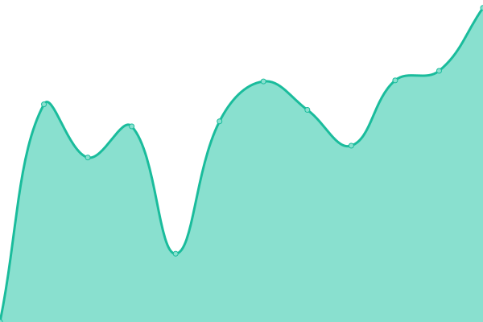 0ms
     
 | 

<a href="https://lacabra23.github.io/upptime/history/superintendencia-de-seguros">0.00%</a>
    

|  [Superintendencia del Mercado de Valores (SIMV)](https://simv.gob.do) | 🟥 Down | [superintendencia-del-mercado-de-valores-simv.yml](https://github.com/lacabra23/upptime/commits/HEAD/history/superintendencia-del-mercado-de-valores-simv.yml) | 

 0ms
     
 | 

<a href="https://lacabra23.github.io/upptime/history/superintendencia-del-mercado-de-valores-simv">0.00%</a>
    

|  [Tesorería de la Seguridad Social (TSS)](https://tss.gob.do) | 🟩 Up | [tesoreria-de-la-seguridad-social-tss.yml](https://github.com/lacabra23/upptime/commits/HEAD/history/tesoreria-de-la-seguridad-social-tss.yml) | 

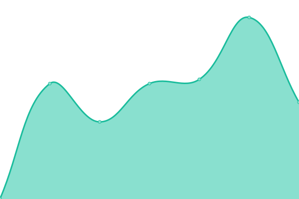 0ms
     
 | 

<a href="https://lacabra23.github.io/upptime/history/tesoreria-de-la-seguridad-social-tss">100.00%</a>
    

|  [Tesorería Nacional](https://tesoreria.gob.do) | 🟥 Down | [tesoreria-nacional.yml](https://github.com/lacabra23/upptime/commits/HEAD/history/tesoreria-nacional.yml) | 

 0ms
     
 | 

<a href="https://lacabra23.github.io/upptime/history/tesoreria-nacional">0.00%</a>
    

|  [Unidad de Análisis Financiero (UAF)](https://uaf.gob.do) | 🟥 Down | [unidad-de-analisis-financiero-uaf.yml](https://github.com/lacabra23/upptime/commits/HEAD/history/unidad-de-analisis-financiero-uaf.yml) | 

 0ms
     
 | 

<a href="https://lacabra23.github.io/upptime/history/unidad-de-analisis-financiero-uaf">0.00%</a>
    

|  [Unidad para la Readecuación de Barrios y Entornos (URBE)](https://urbe.gob.do) | 🟩 Up | [unidad-para-la-readecuacion-de-barrios-y-entornos-urbe.yml](https://github.com/lacabra23/upptime/commits/HEAD/history/unidad-para-la-readecuacion-de-barrios-y-entornos-urbe.yml) | 

 2411ms
     
 | 

<a href="https://lacabra23.github.io/upptime/history/unidad-para-la-readecuacion-de-barrios-y-entornos-urbe">100.00%</a>
    

|  [Comisión Permanente de Titulación de Terrenos del Estado](https://titulacion.gob.do) | 🟩 Up | [comision-permanente-de-titulacion-de-terrenos-del-estado.yml](https://github.com/lacabra23/upptime/commits/HEAD/history/comision-permanente-de-titulacion-de-terrenos-del-estado.yml) | 

 2555ms
     
 | 

<a href="https://lacabra23.github.io/upptime/history/comision-permanente-de-titulacion-de-terrenos-del-estado">100.00%</a>
    

|  [Lotería Nacional Dominicana](https://loterianacional.gob.do) | 🟩 Up | [loteria-nacional-dominicana.yml](https://github.com/lacabra23/upptime/commits/HEAD/history/loteria-nacional-dominicana.yml) | 

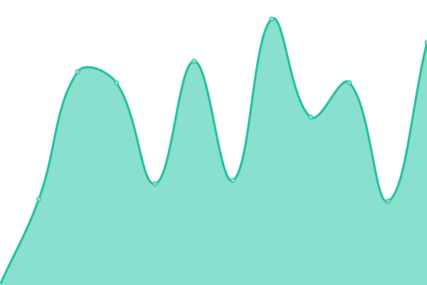 471ms
     
 | 

<a href="https://lacabra23.github.io/upptime/history/loteria-nacional-dominicana">76.24%</a>
    

|  [Intelligence Security Operation Center (ISOC-RD)](https://isocrd.gob.do) | 🟥 Down | [intelligence-security-operation-center-isoc-rd.yml](https://github.com/lacabra23/upptime/commits/HEAD/history/intelligence-security-operation-center-isoc-rd.yml) | 

 0ms
     
 | 

<a href="https://lacabra23.github.io/upptime/history/intelligence-security-operation-center-isoc-rd">0.00%</a>
    

|  [Oficina Nacional de la Propiedad Industrial (ONAPI)](https://onapi.gob.do) | 🟩 Up | [oficina-nacional-de-la-propiedad-industrial-onapi.yml](https://github.com/lacabra23/upptime/commits/HEAD/history/oficina-nacional-de-la-propiedad-industrial-onapi.yml) | 

 0ms
     
 | 

<a href="https://lacabra23.github.io/upptime/history/oficina-nacional-de-la-propiedad-industrial-onapi">100.00%</a>
    

|  [Gabinete de Política Social](https://gabsocial.gob.do) | 🟥 Down | [gabinete-de-politica-social.yml](https://github.com/lacabra23/upptime/commits/HEAD/history/gabinete-de-politica-social.yml) | 

 2120ms
     
 | 

<a href="https://lacabra23.github.io/upptime/history/gabinete-de-politica-social">4.06%</a>
    

|  [Ayuntamiento del Distrito Nacional (ADN)](https://adn.gob.do) | 🟥 Down | [ayuntamiento-del-distrito-nacional-adn.yml](https://github.com/lacabra23/upptime/commits/HEAD/history/ayuntamiento-del-distrito-nacional-adn.yml) | 

 0ms
     
 | 

<a href="https://lacabra23.github.io/upptime/history/ayuntamiento-del-distrito-nacional-adn">0.00%</a>
    

|  [Superintendencia de Seguros](https://superseguros.gob.do) | 🟥 Down | [superintendencia-de-seguros.yml](https://github.com/lacabra23/upptime/commits/HEAD/history/superintendencia-de-seguros.yml) | 

 0ms
     
 | 

<a href="https://lacabra23.github.io/upptime/history/superintendencia-de-seguros">0.00%</a>
    

|  [Tesorería de la Seguridad Social (TSS)](https://tss.gob.do) | 🟩 Up | [tesoreria-de-la-seguridad-social-tss.yml](https://github.com/lacabra23/upptime/commits/HEAD/history/tesoreria-de-la-seguridad-social-tss.yml) | 

 0ms
     
 | 

<a href="https://lacabra23.github.io/upptime/history/tesoreria-de-la-seguridad-social-tss">100.00%</a>
    

|  [Programa de Protección Social Supérate](https://superate.gob.do) | 🟥 Down | [programa-de-proteccion-social-superate.yml](https://github.com/lacabra23/upptime/commits/HEAD/history/programa-de-proteccion-social-superate.yml) | 

 0ms
     
 | 

<a href="https://lacabra23.github.io/upptime/history/programa-de-proteccion-social-superate">0.00%</a>
    

|  [Liga Municipal Dominicana](https://lmd.gob.do) | 🟥 Down | [liga-municipal-dominicana.yml](https://github.com/lacabra23/upptime/commits/HEAD/history/liga-municipal-dominicana.yml) | 

 0ms
     
 | 

<a href="https://lacabra23.github.io/upptime/history/liga-municipal-dominicana">99.98%</a>
    

|  [Instituto Nacional de Bienestar Magisterial](https://inabima.gob.do) | 🟩 Up | [instituto-nacional-de-bienestar-magisterial.yml](https://github.com/lacabra23/upptime/commits/HEAD/history/instituto-nacional-de-bienestar-magisterial.yml) | 

 0ms
     
 | 

<a href="https://lacabra23.github.io/upptime/history/instituto-nacional-de-bienestar-magisterial">100.00%</a>
    

|  [Oficina Nacional de Meteorología](https://onamet.gob.do) | 🟩 Up | [oficina-nacional-de-meteorologia.yml](https://github.com/lacabra23/upptime/commits/HEAD/history/oficina-nacional-de-meteorologia.yml) | 

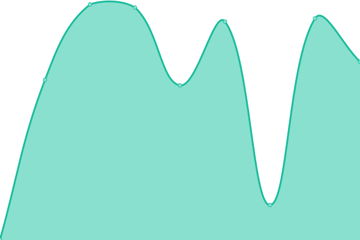 2296ms
     
 | 

<a href="https://lacabra23.github.io/upptime/history/oficina-nacional-de-meteorologia">98.97%</a>
    

|  [Dirección General de Alianzas Público Privadas](https://dgapp.gob.do) | 🟩 Up | [direccion-general-de-alianzas-publico-privadas.yml](https://github.com/lacabra23/upptime/commits/HEAD/history/direccion-general-de-alianzas-publico-privadas.yml) | 

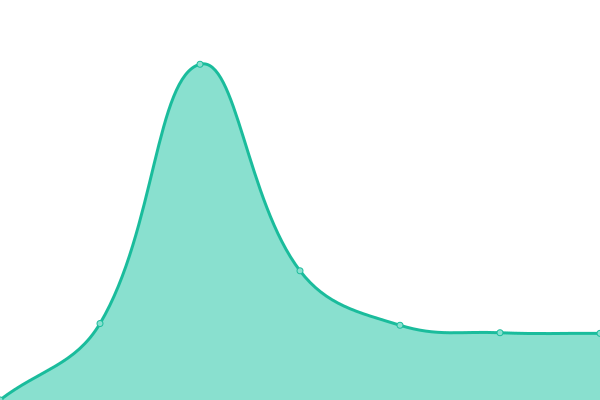 0ms
     
 | 

<a href="https://lacabra23.github.io/upptime/history/direccion-general-de-alianzas-publico-privadas">100.00%</a>
    

|  [Sistema 3-1-1](https://311.gob.do) | 🟩 Up | [sistema-3-1-1.yml](https://github.com/lacabra23/upptime/commits/HEAD/history/sistema-3-1-1.yml) | 

 0ms
     
 | 

<a href="https://lacabra23.github.io/upptime/history/sistema-3-1-1">100.00%</a>
    

|  [Instituto Nacional de Administración Pública](https://inap.gob.do) | 🟩 Up | [instituto-nacional-de-administracion-publica.yml](https://github.com/lacabra23/upptime/commits/HEAD/history/instituto-nacional-de-administracion-publica.yml) | 

 0ms
     
 | 

<a href="https://lacabra23.github.io/upptime/history/instituto-nacional-de-administracion-publica">100.00%</a>
    

|  [Sistema Electrónico de Contrataciones Públicas](https://comprasdominicana.gob.do) | 🟥 Down | [sistema-electronico-de-contrataciones-publicas.yml](https://github.com/lacabra23/upptime/commits/HEAD/history/sistema-electronico-de-contrataciones-publicas.yml) | 

 0ms
     
 | 

<a href="https://lacabra23.github.io/upptime/history/sistema-electronico-de-contrataciones-publicas">0.00%</a>
    

|  [Archivo General de la Nación](https://agn.gob.do) | 🟥 Down | [archivo-general-de-la-nacion.yml](https://github.com/lacabra23/upptime/commits/HEAD/history/archivo-general-de-la-nacion.yml) | 

 0ms
     
 | 

<a href="https://lacabra23.github.io/upptime/history/archivo-general-de-la-nacion">0.00%</a>
    

<!--end: status pages-->

[**Visit our status website →**](https://demo.upptime.js.org)

## 📄 License

- Powered by: [Upptime](https://github.com/upptime/upptime)
- Code: [MIT](./LICENSE) © [Anand Chowdhary](https://anandchowdhary.com), supported by [Pabio](https://pabio.com)
- Data in the `./history` directory: [Open Database License](https://opendatacommons.org/licenses/odbl/1-0/)
